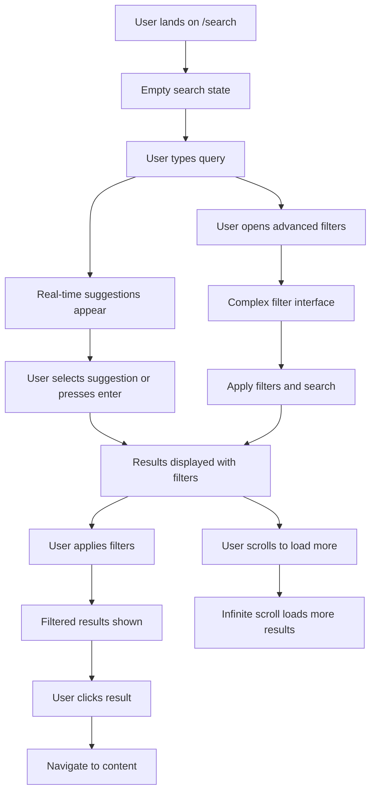
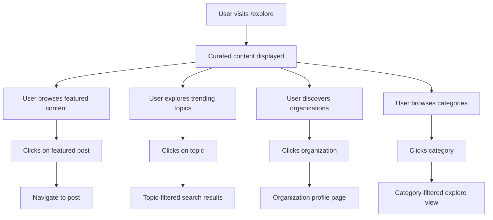

# Search & Discovery System Design

## Medium-like Blogging Platform

---

## Executive Summary

This document outlines the comprehensive design for a Search & Discovery system for our TanStack Start-based blogging platform. The system focuses on PostgreSQL optimization, advanced filtering capabilities, and exceptional user experience while maintaining performance at scale.

**Related Strategic Documents:**

- **[Content Creation System Design](./content_creation_writing_interface_design.md)** - Content authoring and publishing workflows that feed into search
- **[Navigation Architecture](./ux_architecture_navigation_design.md)** - Organization-aware navigation and discovery patterns
- **[Implementation Roadmap](./implementation_roadmap_content_creation.md)** - Development planning for content and search features

**Technical Implementation:**

- **[Project Overview](../../docs/overview/introduction.md)** - Technical architecture and current project status
- **[Database Design](../../docs/architecture/database.md)** - PostgreSQL schema and full-text search optimization
- **[Development Guide](../../docs/development/index.md)** - Performance patterns and query optimization
- **[Search API Reference](../../docs/api/search.md)** - Implementation details for search endpoints

### Key Design Principles

- **PostgreSQL-First**: Optimized full-text search without external dependencies
- **Advanced Filtering Priority**: Robust filtering system as primary feature
- **Mobile-Optimized UX**: Progressive disclosure and touch-friendly interfaces
- **Performance-Conscious**: Strategic indexing and query optimization
- **Analytics-Ready**: Sentry/PostHog integration for user behavior insights

### Core Features

1. Universal search with intelligent ranking
2. Advanced filtering system with multiple content types
3. Topic-based content discovery
4. Organization-centric exploration
5. Real-time search with proper optimization
6. Search history and personalization

---

## Database Schema Design

### Enhanced Posts Schema

```typescript
export const posts = pgTable(
  'posts',
  {
    id: text()
      .primaryKey()
      .$defaultFn(() => nanoid()),
    title: varchar({ length: 255 }).notNull(),
    body: text().notNull(),
    excerpt: varchar({ length: 500 }), // Auto-generated or manual summary
    readingTime: integer().notNull().default(0), // Minutes

    // Content Organization
    slug: varchar({ length: 300 }).notNull().unique(),
    status: varchar({ length: 20 }).notNull().default('draft'), // draft, published, archived
    visibility: varchar({ length: 20 }).notNull().default('public'), // public, private, organization

    // Authorship
    userId: text()
      .notNull()
      .references(() => users.id, { onDelete: 'cascade' }),
    organizationId: text().references(() => organizations.id, {
      onDelete: 'set null',
    }),

    // Search Optimization
    searchVector: text(), // tsvector for PostgreSQL full-text search
    searchTags: text(), // Concatenated tags for quick filtering

    // Engagement Metrics (for ranking)
    viewCount: integer().notNull().default(0),
    likeCount: integer().notNull().default(0),
    commentCount: integer().notNull().default(0),
    shareCount: integer().notNull().default(0),

    // SEO & Discovery
    featuredImageUrl: varchar({ length: 500 }),
    metaDescription: varchar({ length: 160 }),
    canonicalUrl: varchar({ length: 500 }),

    // Publishing
    publishedAt: timestamp({ withTimezone: true }),
    lastModifiedAt: timestamp({ withTimezone: true })
      .notNull()
      .defaultNow()
      .$onUpdate(() => new Date()),
    createdAt: timestamp({ withTimezone: true }).notNull().defaultNow(),
  },
  (table) => [
    // Full-text search indexes
    index('posts_search_vector_gin_idx').using('gin', table.searchVector),
    index('posts_search_tags_gin_idx').using('gin', table.searchTags),

    // Performance indexes for filtering
    index('posts_status_published_at_idx')
      .on(table.status, table.publishedAt)
      .where(sql`status = 'published'`),
    index('posts_organization_published_idx').on(
      table.organizationId,
      table.status,
      table.publishedAt,
    ),
    index('posts_user_status_idx').on(
      table.userId,
      table.status,
      table.publishedAt,
    ),

    // Trending/ranking indexes
    index('posts_trending_idx').on(
      table.status,
      table.viewCount,
      table.likeCount,
      table.publishedAt,
    ),
    index('posts_engagement_idx').on(
      table.status,
      table.likeCount,
      table.commentCount,
      table.shareCount,
    ),

    // General performance
    index('posts_created_at_idx').on(table.createdAt),
    index('posts_slug_idx').on(table.slug),
  ],
);
```

### New Tables for Enhanced Search

#### Tags System

```typescript
export const tags = pgTable(
  'tags',
  {
    id: text()
      .primaryKey()
      .$defaultFn(() => nanoid()),
    name: varchar({ length: 100 }).notNull().unique(),
    slug: varchar({ length: 100 }).notNull().unique(),
    description: varchar({ length: 500 }),
    color: varchar({ length: 7 }).default('#6366f1'), // Hex color
    postCount: integer().notNull().default(0), // Denormalized for performance
    createdAt: timestamp({ withTimezone: true }).notNull().defaultNow(),
  },
  (table) => [
    index('tags_name_idx').on(table.name),
    index('tags_post_count_idx').on(table.postCount),
  ],
);

export const postTags = pgTable(
  'post_tags',
  {
    postId: text()
      .notNull()
      .references(() => posts.id, { onDelete: 'cascade' }),
    tagId: text()
      .notNull()
      .references(() => tags.id, { onDelete: 'cascade' }),
    createdAt: timestamp({ withTimezone: true }).notNull().defaultNow(),
  },
  (table) => [
    primaryKey({ columns: [table.postId, table.tagId] }),
    index('post_tags_post_id_idx').on(table.postId),
    index('post_tags_tag_id_idx').on(table.tagId),
  ],
);
```

#### Categories/Topics System

```typescript
export const categories = pgTable(
  'categories',
  {
    id: text()
      .primaryKey()
      .$defaultFn(() => nanoid()),
    name: varchar({ length: 100 }).notNull(),
    slug: varchar({ length: 100 }).notNull().unique(),
    description: text(),
    parentId: text().references(() => categories.id, { onDelete: 'set null' }),
    iconName: varchar({ length: 50 }), // Lucide icon name
    color: varchar({ length: 7 }).default('#6366f1'),
    postCount: integer().notNull().default(0),
    featuredImageUrl: varchar({ length: 500 }),
    sortOrder: integer().notNull().default(0),
    isActive: boolean().notNull().default(true),
    createdAt: timestamp({ withTimezone: true }).notNull().defaultNow(),
  },
  (table) => [
    index('categories_slug_idx').on(table.slug),
    index('categories_parent_idx').on(table.parentId),
    index('categories_active_sort_idx').on(table.isActive, table.sortOrder),
  ],
);

export const postCategories = pgTable(
  'post_categories',
  {
    postId: text()
      .notNull()
      .references(() => posts.id, { onDelete: 'cascade' }),
    categoryId: text()
      .notNull()
      .references(() => categories.id, { onDelete: 'cascade' }),
    isPrimary: boolean().notNull().default(false),
    createdAt: timestamp({ withTimezone: true }).notNull().defaultNow(),
  },
  (table) => [
    primaryKey({ columns: [table.postId, table.categoryId] }),
    index('post_categories_post_id_idx').on(table.postId),
    index('post_categories_category_id_idx').on(table.categoryId),
    index('post_categories_primary_idx').on(table.isPrimary),
  ],
);
```

#### Search Analytics

```typescript
export const searchQueries = pgTable(
  'search_queries',
  {
    id: text()
      .primaryKey()
      .$defaultFn(() => nanoid()),
    query: varchar({ length: 500 }).notNull(),
    userId: text().references(() => users.id, { onDelete: 'set null' }),
    resultCount: integer().notNull(),
    clickedResultId: text(), // Track which result was clicked
    clickedResultType: varchar({ length: 50 }), // post, user, organization
    filters: jsonb(), // Store applied filters as JSON
    responseTimeMs: integer(), // Track search performance
    createdAt: timestamp({ withTimezone: true }).notNull().defaultNow(),
  },
  (table) => [
    index('search_queries_query_idx').on(table.query),
    index('search_queries_user_idx').on(table.userId),
    index('search_queries_created_at_idx').on(table.createdAt),
  ],
);
```

---

## User Experience Design

### Search Interface (/search)

#### Desktop Layout

```text
┌─────────────────────────────────────────────────────────────────┐
│ [🔍] Search posts, people, and organizations...        [⚙️]     │
├─────────────────────────────────────────────────────────────────┤
│ Quick Filters: [All] [Posts] [People] [Organizations]          │
│ ┌─[Date: Any time ▼]─[Sort: Relevance ▼]─[More filters ▼]─┐   │
├─┴─────────────────────────────────────────────────────────────┴─┤
│                                                                 │
│ Search Results (1,234 results in 0.03s)                       │
│                                                                 │
│ ┌─────────────────────────────────────────────────────────────┐ │
│ │ 📝 How to Build Modern Web Applications                     │ │
│ │ by John Doe · TechCorp · 5 min read · Mar 15, 2024        │ │
│ │ Learn the fundamentals of building modern web apps...      │ │
│ │ #react #typescript #web-development                         │ │
│ └─────────────────────────────────────────────────────────────┘ │
│                                                                 │
│ ┌─────────────────────────────────────────────────────────────┐ │
│ │ 👤 Sarah Johnson                                            │ │
│ │ Senior Developer at DevCorp · 150 followers                │ │
│ │ Writes about: React, Node.js, Database Design              │ │
│ │ Latest post: "Database Optimization Tips" · 2 days ago     │ │
│ └─────────────────────────────────────────────────────────────┘ │
│                                                                 │
│ ┌─────────────────────────────────────────────────────────────┐ │
│ │ 🏢 TechStartup Inc.                                         │ │
│ │ 25 members · 87 posts · Technology                         │ │
│ │ Building the future of web development...                   │ │
│ │ Recent: "Our Journey to TypeScript" · 1 week ago           │ │
│ └─────────────────────────────────────────────────────────────┘ │
│                                                                 │
│                        [Load More Results]                      │
└─────────────────────────────────────────────────────────────────┘
```

#### Advanced Filters Panel

```text
┌─────────────────────────────────────────┐
│ Advanced Filters                    [×] │
├─────────────────────────────────────────┤
│ Content Type                           │
│ ☑️ Posts    ☑️ People    ☑️ Organizations │
│                                         │
│ Date Range                              │
│ ◯ Any time   ◯ Past week   ◯ Past month │
│ ◯ Past year  ● Custom range             │
│ From: [Mar 1, 2024] To: [Mar 31, 2024] │
│                                         │
│ Categories                              │
│ ☑️ Technology  ☑️ Design  ☐ Business     │
│ ☐ Science     ☐ Health   ☐ Education   │
│                                         │
│ Tags                                    │
│ [react        ×] [typescript    ×]      │
│ [+ Add tag...]                          │
│                                         │
│ Reading Time (Posts)                    │
│ ◯ Any  ◯ < 5 min  ◯ 5-10 min  ◯ > 10min │
│                                         │
│ Organization                            │
│ [Select organization...]                │
│                                         │
│ Author                                  │
│ [Search authors...]                     │
│                                         │
│ Engagement                              │
│ Min likes: [____]  Min views: [____]   │
│                                         │
│      [Reset All]    [Apply Filters]     │
└─────────────────────────────────────────┘
```

#### Mobile Search Interface

```text
┌─────────────────────────┐
│ [🔍] Search...      [⚙️] │
├─────────────────────────┤
│ [All] [Posts] [People]   │
├─────────────────────────┤
│ 📝 Modern Web Apps      │
│ John Doe · 5 min read   │
│ TechCorp · Mar 15       │
│ #react #typescript      │
├─────────────────────────┤
│ 👤 Sarah Johnson        │
│ Senior Developer        │
│ DevCorp · 150 followers │
├─────────────────────────┤
│ 🏢 TechStartup Inc.     │
│ 25 members · 87 posts   │
│ Technology              │
├─────────────────────────┤
│    [Load More...]       │
└─────────────────────────┘

// Filters slide up from bottom
┌─────────────────────────┐
│      Filters        [×] │
├─────────────────────────┤
│ Content                 │
│ [Posts] [People] [Orgs] │
│                         │
│ Date: [Any time ▼]      │
│ Sort: [Relevance ▼]     │
│                         │
│ Categories              │
│ ☑️ Tech  ☐ Design       │
│ ☐ Business ☐ Science    │
│                         │
│   [Clear] [Apply (15)]  │
└─────────────────────────┘
```

### Discovery Interface (/explore)

#### Desktop Explore Layout

```text
┌─────────────────────────────────────────────────────────────────┐
│                        Explore Content                          │
├─────────────────────────────────────────────────────────────────┤
│                                                                 │
│ 🌟 Featured This Week                                          │
│ ┌─────────┐ ┌─────────┐ ┌─────────┐ ┌─────────┐ ┌─────────┐   │
│ │[Image]  │ │[Image]  │ │[Image]  │ │[Image]  │ │[Image]  │   │
│ │Title 1  │ │Title 2  │ │Title 3  │ │Title 4  │ │Title 5  │   │
│ │Author   │ │Author   │ │Author   │ │Author   │ │Author   │   │
│ └─────────┘ └─────────┘ └─────────┘ └─────────┘ └─────────┘   │
│                                                      [See All] │
│                                                                 │
│ 📈 Trending Topics                                             │
│ ┌──────────────┐ ┌──────────────┐ ┌──────────────┐            │
│ │ 🚀 Technology│ │ 🎨 Design    │ │ 💼 Business  │            │
│ │ 1,234 posts  │ │ 987 posts    │ │ 654 posts    │            │
│ │ +15% growth  │ │ +8% growth   │ │ +12% growth  │            │
│ └──────────────┘ └──────────────┘ └──────────────┘            │
│                                                                 │
│ 🏢 Active Organizations                                        │
│ ┌─────────────────────────────────────────────────────────────┐ │
│ │ TechCorp        DevStudio      StartupHub    InnovationLab  │ │
│ │ 45 new posts    32 new posts   28 new posts  21 new posts  │ │
│ │ [Follow]        [Follow]       [Follow]      [Follow]      │ │
│ └─────────────────────────────────────────────────────────────┘ │
│                                                      [See All] │
│                                                                 │
│ 📚 Browse by Category                                          │
│ ┌─Technology──┐ ┌─Design─────┐ ┌─Business───┐ ┌─Science────┐  │
│ │ React       │ │ UI/UX      │ │ Startup    │ │ AI/ML      │  │
│ │ TypeScript  │ │ Figma      │ │ Finance    │ │ Data       │  │
│ │ Node.js     │ │ Prototyping│ │ Marketing  │ │ Research   │  │
│ │ DevOps      │ │ Branding   │ │ Strategy   │ │ Innovation │  │
│ └─────────────┘ └─────────────┘ └─────────────┘ └─────────────┘ │
│                                                                 │
│ 🔥 Rising Writers                                              │
│ [Profile cards of emerging authors with growth metrics]         │
│                                                                 │
│ 📊 Platform Stats                                              │
│ [Visual stats: posts this week, new users, active orgs, etc.]  │
└─────────────────────────────────────────────────────────────────┘
```

#### Mobile Explore Layout

```text
┌─────────────────────────┐
│       Explore           │
├─────────────────────────┤
│ 🌟 Featured             │
│ ┌─────────────────────┐ │
│ │ [Featured Post]     │ │
│ │ Title               │ │
│ │ Author · 5 min      │ │
│ └─────────────────────┘ │
│ [Horizontal scroll...]  │
│                         │
│ 📈 Trending Topics      │
│ ┌─────┐ ┌─────┐ ┌─────┐ │
│ │ Tech│ │Design│ │Biz  │ │
│ │1234 │ │ 987 │ │654  │ │
│ └─────┘ └─────┘ └─────┘ │
│                         │
│ 🏢 Organizations        │
│ TechCorp (45 posts)     │
│ DevStudio (32 posts)    │
│ [See all...]            │
│                         │
│ 📚 Categories           │
│ [Grid of category cards]│
│                         │
│ 🔥 Rising Writers       │
│ [Vertical list of       │
│  author cards]          │
└─────────────────────────┘
```

### User Flows

#### Search Flow



#### Discovery Flow



---

## Technical Architecture

### PostgreSQL Full-Text Search Implementation

#### Search Vector Generation

```sql
-- Function to generate search vectors
CREATE OR REPLACE FUNCTION generate_search_vector(
  title VARCHAR(255),
  body TEXT,
  tags TEXT DEFAULT ''
) RETURNS tsvector AS $$
BEGIN
  RETURN setweight(to_tsvector('english', COALESCE(title, '')), 'A') ||
         setweight(to_tsvector('english', COALESCE(body, '')), 'B') ||
         setweight(to_tsvector('english', COALESCE(tags, '')), 'C');
END;
$$ LANGUAGE plpgsql IMMUTABLE;

-- Trigger to automatically update search vectors
CREATE OR REPLACE FUNCTION update_post_search_vector()
RETURNS TRIGGER AS $$
BEGIN
  NEW.search_vector := generate_search_vector(
    NEW.title,
    NEW.body,
    NEW.search_tags
  );
  RETURN NEW;
END;
$$ LANGUAGE plpgsql;

CREATE TRIGGER post_search_vector_update
  BEFORE INSERT OR UPDATE ON posts
  FOR EACH ROW
  EXECUTE FUNCTION update_post_search_vector();
```

#### Advanced Search Query

```typescript
// src/modules/search/api/search-content.ts
import { createServerFn } from '@tanstack/react-start';
import { desc, eq, sql, and, or, gte, lte } from 'drizzle-orm';
import { db } from '@/lib/db/connection';
import {
  posts,
  users,
  organizations,
  tags,
  categories,
} from '@/lib/db/schemas';

export type SearchFilters = {
  query?: string;
  contentType?: ('posts' | 'users' | 'organizations')[];
  dateRange?: {
    from?: string;
    to?: string;
  };
  categories?: string[];
  tags?: string[];
  authorId?: string;
  organizationId?: string;
  readingTime?: {
    min?: number;
    max?: number;
  };
  minLikes?: number;
  minViews?: number;
  sortBy?: 'relevance' | 'date' | 'popularity' | 'engagement';
  limit?: number;
  offset?: number;
};

export type SearchResult = {
  type: 'post' | 'user' | 'organization';
  id: string;
  title: string;
  excerpt?: string;
  url: string;
  metadata: Record<string, unknown>;
  relevanceScore?: number;
};

export const searchContent = createServerFn({ method: 'POST' })
  .validator((data: SearchFilters) => data)
  .handler(async (filters: SearchFilters) => {
    const results: SearchResult[] = [];
    const limit = Math.min(filters.limit || 20, 100);
    const offset = filters.offset || 0;

    // Search Posts
    if (!filters.contentType || filters.contentType.includes('posts')) {
      const postResults = await searchPosts(filters, limit, offset);
      results.push(...postResults);
    }

    // Search Users
    if (!filters.contentType || filters.contentType.includes('users')) {
      const userResults = await searchUsers(filters, limit, offset);
      results.push(...userResults);
    }

    // Search Organizations
    if (!filters.contentType || filters.contentType.includes('organizations')) {
      const orgResults = await searchOrganizations(filters, limit, offset);
      results.push(...orgResults);
    }

    // Sort by relevance if mixed content types
    if (filters.sortBy === 'relevance' || !filters.sortBy) {
      results.sort((a, b) => (b.relevanceScore || 0) - (a.relevanceScore || 0));
    }

    return {
      results: results.slice(0, limit),
      totalCount: await getTotalSearchCount(filters),
      facets: await getSearchFacets(filters),
    };
  });

async function searchPosts(
  filters: SearchFilters,
  limit: number,
  offset: number,
) {
  const conditions = [eq(posts.status, 'published')];

  // Full-text search
  if (filters.query) {
    conditions.push(
      sql`${posts.searchVector} @@ plainto_tsquery('english', ${filters.query})`,
    );
  }

  // Date range filter
  if (filters.dateRange?.from) {
    conditions.push(gte(posts.publishedAt, new Date(filters.dateRange.from)));
  }
  if (filters.dateRange?.to) {
    conditions.push(lte(posts.publishedAt, new Date(filters.dateRange.to)));
  }

  // Author filter
  if (filters.authorId) {
    conditions.push(eq(posts.userId, filters.authorId));
  }

  // Organization filter
  if (filters.organizationId) {
    conditions.push(eq(posts.organizationId, filters.organizationId));
  }

  // Reading time filter
  if (filters.readingTime?.min) {
    conditions.push(gte(posts.readingTime, filters.readingTime.min));
  }
  if (filters.readingTime?.max) {
    conditions.push(lte(posts.readingTime, filters.readingTime.max));
  }

  // Engagement filters
  if (filters.minLikes) {
    conditions.push(gte(posts.likeCount, filters.minLikes));
  }
  if (filters.minViews) {
    conditions.push(gte(posts.viewCount, filters.minViews));
  }

  // Category filter (requires join)
  let categoryCondition = null;
  if (filters.categories?.length) {
    categoryCondition = sql`EXISTS (
      SELECT 1 FROM post_categories pc
      JOIN categories c ON pc.category_id = c.id
      WHERE pc.post_id = ${posts.id}
      AND c.slug = ANY(${filters.categories})
    )`;
  }

  // Tag filter (requires join)
  let tagCondition = null;
  if (filters.tags?.length) {
    tagCondition = sql`EXISTS (
      SELECT 1 FROM post_tags pt
      JOIN tags t ON pt.tag_id = t.id
      WHERE pt.post_id = ${posts.id}
      AND t.slug = ANY(${filters.tags})
    )`;
  }

  if (categoryCondition) conditions.push(categoryCondition);
  if (tagCondition) conditions.push(tagCondition);

  // Build sort order
  let orderBy;
  switch (filters.sortBy) {
    case 'date':
      orderBy = desc(posts.publishedAt);
      break;
    case 'popularity':
      orderBy = desc(posts.viewCount);
      break;
    case 'engagement':
      orderBy = desc(
        sql`${posts.likeCount} + ${posts.commentCount} + ${posts.shareCount}`,
      );
      break;
    case 'relevance':
    default:
      if (filters.query) {
        orderBy = desc(
          sql`ts_rank_cd(${posts.searchVector}, plainto_tsquery('english', ${filters.query}), 32)`,
        );
      } else {
        orderBy = desc(posts.publishedAt);
      }
  }

  const postResults = await db
    .select({
      id: posts.id,
      title: posts.title,
      excerpt: posts.excerpt,
      slug: posts.slug,
      readingTime: posts.readingTime,
      publishedAt: posts.publishedAt,
      viewCount: posts.viewCount,
      likeCount: posts.likeCount,
      authorName: users.name,
      authorUsername: users.username,
      organizationName: organizations.name,
      relevanceScore: filters.query
        ? sql`ts_rank_cd(${posts.searchVector}, plainto_tsquery('english', ${filters.query}), 32)`
        : sql`1`,
    })
    .from(posts)
    .innerJoin(users, eq(posts.userId, users.id))
    .leftJoin(organizations, eq(posts.organizationId, organizations.id))
    .where(and(...conditions))
    .orderBy(orderBy)
    .limit(limit)
    .offset(offset);

  return postResults.map((post) => ({
    type: 'post' as const,
    id: post.id,
    title: post.title,
    excerpt: post.excerpt || undefined,
    url: `/posts/${post.slug}`,
    relevanceScore: Number(post.relevanceScore) || 0,
    metadata: {
      author: {
        name: post.authorName,
        username: post.authorUsername,
      },
      organization: post.organizationName,
      readingTime: post.readingTime,
      publishedAt: post.publishedAt,
      stats: {
        views: post.viewCount,
        likes: post.likeCount,
      },
    },
  }));
}

// Similar implementations for searchUsers() and searchOrganizations()
```

### Indexing Strategy

#### Primary Search Indexes

```sql
-- Full-text search indexes
CREATE INDEX CONCURRENTLY posts_search_vector_gin_idx
  ON posts USING gin(search_vector);

CREATE INDEX CONCURRENTLY posts_search_tags_gin_idx
  ON posts USING gin(search_tags gin_trgm_ops);

-- Composite indexes for common filter combinations
CREATE INDEX CONCURRENTLY posts_status_published_date_idx
  ON posts (status, published_at DESC)
  WHERE status = 'published';

CREATE INDEX CONCURRENTLY posts_author_published_idx
  ON posts (user_id, status, published_at DESC)
  WHERE status = 'published';

CREATE INDEX CONCURRENTLY posts_org_published_idx
  ON posts (organization_id, status, published_at DESC)
  WHERE status = 'published' AND organization_id IS NOT NULL;

-- Trending/ranking indexes
CREATE INDEX CONCURRENTLY posts_trending_score_idx
  ON posts (status, (view_count + like_count * 10 + comment_count * 5) DESC, published_at DESC)
  WHERE status = 'published';

-- Category and tag junction table indexes
CREATE INDEX CONCURRENTLY post_categories_category_posts_idx
  ON post_categories (category_id, post_id);

CREATE INDEX CONCURRENTLY post_tags_tag_posts_idx
  ON post_tags (tag_id, post_id);

-- User search indexes
CREATE INDEX CONCURRENTLY users_search_gin_idx
  ON users USING gin((name || ' ' || COALESCE(username, '')) gin_trgm_ops);

CREATE INDEX CONCURRENTLY users_name_trgm_idx
  ON users USING gin(name gin_trgm_ops);

-- Organization search indexes
CREATE INDEX CONCURRENTLY organizations_search_gin_idx
  ON organizations USING gin((name || ' ' || COALESCE(description, '')) gin_trgm_ops);
```

#### Materialized Views for Performance

```sql
-- Trending posts materialized view (refreshed hourly)
CREATE MATERIALIZED VIEW trending_posts AS
SELECT
  p.id,
  p.title,
  p.slug,
  p.excerpt,
  p.published_at,
  p.view_count,
  p.like_count,
  p.comment_count,
  p.share_count,
  u.name as author_name,
  u.username as author_username,
  o.name as organization_name,
  -- Trending score calculation
  (
    (p.view_count * 1.0) +
    (p.like_count * 10.0) +
    (p.comment_count * 5.0) +
    (p.share_count * 15.0) +
    -- Time decay factor (newer posts get boost)
    (EXTRACT(EPOCH FROM (NOW() - p.published_at)) / 3600.0 * -0.1)
  ) as trending_score
FROM posts p
JOIN users u ON p.user_id = u.id
LEFT JOIN organizations o ON p.organization_id = o.id
WHERE
  p.status = 'published'
  AND p.published_at > NOW() - INTERVAL '30 days'
ORDER BY trending_score DESC
LIMIT 1000;

-- Create unique index for concurrent refresh
CREATE UNIQUE INDEX trending_posts_id_idx ON trending_posts (id);

-- Popular tags materialized view
CREATE MATERIALIZED VIEW popular_tags AS
SELECT
  t.id,
  t.name,
  t.slug,
  t.color,
  t.post_count,
  COUNT(pt.post_id) as recent_post_count
FROM tags t
JOIN post_tags pt ON t.id = pt.tag_id
JOIN posts p ON pt.post_id = p.id
WHERE
  p.status = 'published'
  AND p.published_at > NOW() - INTERVAL '30 days'
GROUP BY t.id, t.name, t.slug, t.color, t.post_count
ORDER BY recent_post_count DESC
LIMIT 100;

CREATE UNIQUE INDEX popular_tags_id_idx ON popular_tags (id);
```

### Query Optimization Patterns

#### Search Result Caching

```typescript
// src/modules/search/api/cached-search.ts
import { createServerFn } from '@tanstack/react-start';
import { Redis } from 'ioredis';

const redis = new Redis(process.env.REDIS_URL);

export const cachedSearch = createServerFn({ method: 'POST' })
  .validator((data: SearchFilters) => data)
  .handler(async (filters: SearchFilters) => {
    // Create cache key from filters
    const cacheKey = `search:${JSON.stringify(filters)}`;

    // Try to get from cache first
    const cached = await redis.get(cacheKey);
    if (cached) {
      return JSON.parse(cached);
    }

    // Perform search
    const results = await searchContent(filters);

    // Cache results for 5 minutes
    await redis.setex(cacheKey, 300, JSON.stringify(results));

    return results;
  });
```

#### Connection Pool Optimization

```typescript
// src/lib/db/connection.ts
import { drizzle } from 'drizzle-orm/postgres-js';
import postgres from 'postgres';

// Optimized connection pool for search queries
export const searchDb = drizzle(
  postgres(process.env.DATABASE_URL!, {
    max: 20, // Higher connection limit for search
    idle_timeout: 20,
    connect_timeout: 10,
    prepare: false, // Disable prepared statements for dynamic queries
  }),
);
```

---

## Advanced Filtering System

### Filter Architecture

The advanced filtering system is designed with flexibility and performance as core principles. It supports multiple content types with shared filter patterns and type-specific filters.

#### Filter Types and Components

```typescript
// src/modules/search/types/filters.ts
export type FilterValue =
  | string
  | number
  | boolean
  | string[]
  | number[]
  | DateRange;

export interface DateRange {
  from?: string;
  to?: string;
}

export interface NumericRange {
  min?: number;
  max?: number;
}

export interface BaseFilter {
  id: string;
  label: string;
  type:
    | 'select'
    | 'multi-select'
    | 'date-range'
    | 'numeric-range'
    | 'boolean'
    | 'search';
  category: 'content' | 'metadata' | 'engagement' | 'temporal';
  value?: FilterValue;
  options?: FilterOption[];
  placeholder?: string;
  validation?: FilterValidation;
}

export interface FilterOption {
  value: string | number;
  label: string;
  count?: number; // For faceted search
  color?: string; // For visual filters like tags/categories
  icon?: string; // Lucide icon name
}

export interface FilterValidation {
  required?: boolean;
  min?: number;
  max?: number;
  pattern?: RegExp;
}

export interface FilterGroup {
  id: string;
  label: string;
  icon?: string;
  collapsible: boolean;
  defaultExpanded: boolean;
  filters: BaseFilter[];
}
```

#### Dynamic Filter Configuration

```typescript
// src/modules/search/config/filter-config.ts
import type { FilterGroup } from '@/modules/search/types/filters';

export const searchFilterConfig: Record<string, FilterGroup[]> = {
  posts: [
    {
      id: 'content-type',
      label: 'Content',
      icon: 'FileText',
      collapsible: false,
      defaultExpanded: true,
      filters: [
        {
          id: 'content-type',
          label: 'Content Type',
          type: 'multi-select',
          category: 'content',
          options: [
            { value: 'posts', label: 'Posts', icon: 'FileText' },
            { value: 'users', label: 'People', icon: 'Users' },
            {
              value: 'organizations',
              label: 'Organizations',
              icon: 'Building',
            },
          ],
        },
      ],
    },
    {
      id: 'categorization',
      label: 'Topics & Tags',
      icon: 'Tag',
      collapsible: true,
      defaultExpanded: false,
      filters: [
        {
          id: 'categories',
          label: 'Categories',
          type: 'multi-select',
          category: 'metadata',
          placeholder: 'Select categories...',
          // Options populated dynamically from API
        },
        {
          id: 'tags',
          label: 'Tags',
          type: 'multi-select',
          category: 'metadata',
          placeholder: 'Search tags...',
          // Options populated dynamically with search
        },
      ],
    },
    {
      id: 'metadata',
      label: 'Post Details',
      icon: 'Info',
      collapsible: true,
      defaultExpanded: false,
      filters: [
        {
          id: 'reading-time',
          label: 'Reading Time',
          type: 'select',
          category: 'metadata',
          options: [
            { value: 'any', label: 'Any length' },
            { value: '0-5', label: 'Quick read (< 5 min)' },
            { value: '5-10', label: 'Medium read (5-10 min)' },
            { value: '10-999', label: 'Long read (> 10 min)' },
          ],
        },
        {
          id: 'author',
          label: 'Author',
          type: 'search',
          category: 'metadata',
          placeholder: 'Search authors...',
        },
        {
          id: 'organization',
          label: 'Organization',
          type: 'search',
          category: 'metadata',
          placeholder: 'Search organizations...',
        },
      ],
    },
    {
      id: 'temporal',
      label: 'Date & Time',
      icon: 'Calendar',
      collapsible: true,
      defaultExpanded: false,
      filters: [
        {
          id: 'date-range',
          label: 'Published Date',
          type: 'date-range',
          category: 'temporal',
        },
        {
          id: 'date-preset',
          label: 'Quick Date Filter',
          type: 'select',
          category: 'temporal',
          options: [
            { value: 'any', label: 'Any time' },
            { value: 'today', label: 'Today' },
            { value: 'week', label: 'Past week' },
            { value: 'month', label: 'Past month' },
            { value: 'year', label: 'Past year' },
          ],
        },
      ],
    },
    {
      id: 'engagement',
      label: 'Engagement',
      icon: 'Heart',
      collapsible: true,
      defaultExpanded: false,
      filters: [
        {
          id: 'min-likes',
          label: 'Minimum Likes',
          type: 'numeric-range',
          category: 'engagement',
          validation: { min: 0, max: 10000 },
        },
        {
          id: 'min-views',
          label: 'Minimum Views',
          type: 'numeric-range',
          category: 'engagement',
          validation: { min: 0, max: 100000 },
        },
        {
          id: 'engagement-level',
          label: 'Engagement Level',
          type: 'select',
          category: 'engagement',
          options: [
            { value: 'any', label: 'Any engagement' },
            { value: 'high', label: 'Highly engaged (>100 likes)' },
            { value: 'medium', label: 'Well engaged (>25 likes)' },
            { value: 'new', label: 'Emerging content (<5 likes)' },
          ],
        },
      ],
    },
  ],
  users: [
    {
      id: 'user-metadata',
      label: 'Profile',
      icon: 'User',
      collapsible: false,
      defaultExpanded: true,
      filters: [
        {
          id: 'user-type',
          label: 'User Type',
          type: 'select',
          category: 'metadata',
          options: [
            { value: 'all', label: 'All users' },
            { value: 'active-writers', label: 'Active writers' },
            { value: 'organizations-members', label: 'Organization members' },
            { value: 'verified', label: 'Verified users' },
          ],
        },
        {
          id: 'follower-count',
          label: 'Followers',
          type: 'select',
          category: 'engagement',
          options: [
            { value: 'any', label: 'Any following' },
            { value: '0-10', label: 'New (< 10 followers)' },
            { value: '10-100', label: 'Growing (10-100 followers)' },
            { value: '100-1000', label: 'Popular (100-1000 followers)' },
            { value: '1000+', label: 'Influential (> 1000 followers)' },
          ],
        },
      ],
    },
    {
      id: 'activity',
      label: 'Activity',
      icon: 'Activity',
      collapsible: true,
      defaultExpanded: false,
      filters: [
        {
          id: 'post-count',
          label: 'Posts Published',
          type: 'numeric-range',
          category: 'engagement',
          validation: { min: 0, max: 1000 },
        },
        {
          id: 'last-active',
          label: 'Last Active',
          type: 'select',
          category: 'temporal',
          options: [
            { value: 'any', label: 'Any time' },
            { value: 'today', label: 'Today' },
            { value: 'week', label: 'This week' },
            { value: 'month', label: 'This month' },
            { value: 'inactive', label: 'Inactive (> 3 months)' },
          ],
        },
      ],
    },
  ],
  organizations: [
    {
      id: 'org-metadata',
      label: 'Organization',
      icon: 'Building',
      collapsible: false,
      defaultExpanded: true,
      filters: [
        {
          id: 'org-size',
          label: 'Size',
          type: 'select',
          category: 'metadata',
          options: [
            { value: 'any', label: 'Any size' },
            { value: '1-5', label: 'Small (1-5 members)' },
            { value: '5-25', label: 'Medium (5-25 members)' },
            { value: '25-100', label: 'Large (25-100 members)' },
            { value: '100+', label: 'Enterprise (> 100 members)' },
          ],
        },
        {
          id: 'org-activity',
          label: 'Activity Level',
          type: 'select',
          category: 'engagement',
          options: [
            { value: 'any', label: 'Any activity' },
            { value: 'very-active', label: 'Very active (> 10 posts/month)' },
            { value: 'active', label: 'Active (5-10 posts/month)' },
            { value: 'moderate', label: 'Moderate (1-5 posts/month)' },
            { value: 'quiet', label: 'Quiet (< 1 post/month)' },
          ],
        },
      ],
    },
  ],
};
```

#### Filter State Management

```typescript
// src/modules/search/hooks/use-search-filters.ts
import { useState, useCallback, useMemo } from 'react';
import type { BaseFilter, FilterValue } from '@/modules/search/types/filters';
import { searchFilterConfig } from '@/modules/search/config/filter-config';

export interface FilterState {
  [filterId: string]: FilterValue;
}

export function useSearchFilters(contentType: string = 'posts') {
  const [filters, setFilters] = useState<FilterState>({});
  const [activeFilterCount, setActiveFilterCount] = useState(0);

  const filterConfig = useMemo(() => {
    return searchFilterConfig[contentType] || searchFilterConfig.posts;
  }, [contentType]);

  const updateFilter = useCallback((filterId: string, value: FilterValue) => {
    setFilters((prev) => {
      const newFilters = { ...prev };

      if (
        value === undefined ||
        value === '' ||
        (Array.isArray(value) && value.length === 0)
      ) {
        delete newFilters[filterId];
      } else {
        newFilters[filterId] = value;
      }

      // Update active filter count
      const count = Object.keys(newFilters).filter((key) => {
        const filterValue = newFilters[key];
        return (
          filterValue !== undefined &&
          filterValue !== '' &&
          (!Array.isArray(filterValue) || filterValue.length > 0)
        );
      }).length;

      setActiveFilterCount(count);

      return newFilters;
    });
  }, []);

  const clearFilter = useCallback(
    (filterId: string) => {
      updateFilter(filterId, undefined);
    },
    [updateFilter],
  );

  const clearAllFilters = useCallback(() => {
    setFilters({});
    setActiveFilterCount(0);
  }, []);

  const getFilterValue = useCallback(
    (filterId: string) => {
      return filters[filterId];
    },
    [filters],
  );

  const hasActiveFilters = useMemo(() => {
    return activeFilterCount > 0;
  }, [activeFilterCount]);

  // Convert filter state to search API format
  const toSearchFilters = useCallback(() => {
    const searchFilters: Record<string, unknown> = {};

    Object.entries(filters).forEach(([filterId, value]) => {
      switch (filterId) {
        case 'content-type':
          searchFilters.contentType = Array.isArray(value) ? value : [value];
          break;
        case 'categories':
          searchFilters.categories = Array.isArray(value) ? value : [value];
          break;
        case 'tags':
          searchFilters.tags = Array.isArray(value) ? value : [value];
          break;
        case 'date-range':
          if (typeof value === 'object' && value !== null && 'from' in value) {
            searchFilters.dateRange = value;
          }
          break;
        case 'reading-time':
          if (typeof value === 'string' && value !== 'any') {
            const [min, max] = value.split('-').map(Number);
            searchFilters.readingTime = {
              min,
              max: max === 999 ? undefined : max,
            };
          }
          break;
        case 'min-likes':
          if (typeof value === 'number' && value > 0) {
            searchFilters.minLikes = value;
          }
          break;
        case 'min-views':
          if (typeof value === 'number' && value > 0) {
            searchFilters.minViews = value;
          }
          break;
        // Add more filter mappings as needed
      }
    });

    return searchFilters;
  }, [filters]);

  return {
    filters,
    filterConfig,
    activeFilterCount,
    hasActiveFilters,
    updateFilter,
    clearFilter,
    clearAllFilters,
    getFilterValue,
    toSearchFilters,
  };
}
```

#### Filter Components

```typescript
// src/modules/search/components/filters/filter-panel.tsx
import { useState } from 'react';
import { ChevronDown, ChevronUp, X, RotateCcw } from 'lucide-react';
import { Button } from '@/components/ui/button';
import { Card, CardContent, CardHeader, CardTitle } from '@/components/ui/card';
import { Badge } from '@/components/ui/badge';
import { Collapsible, CollapsibleContent, CollapsibleTrigger } from '@/components/ui/collapsible';
import { FilterGroup } from '@/modules/search/components/filters/filter-group';
import { useSearchFilters } from '@/modules/search/hooks/use-search-filters';

interface FilterPanelProps {
  contentType: string;
  onFiltersChange: (filters: SearchFilters) => void;
  className?: string;
}

export function FilterPanel({ contentType, onFiltersChange, className }: FilterPanelProps) {
  const {
    filterConfig,
    activeFilterCount,
    hasActiveFilters,
    updateFilter,
    clearAllFilters,
    getFilterValue,
    toSearchFilters,
  } = useSearchFilters(contentType);

  const [expandedGroups, setExpandedGroups] = useState<Set<string>>(
    new Set(
      filterConfig
        .filter(group => group.defaultExpanded)
        .map(group => group.id)
    )
  );

  const handleFilterChange = (filterId: string, value: FilterValue) => {
    updateFilter(filterId, value);
    // Debounce the API call
    setTimeout(() => {
      onFiltersChange(toSearchFilters());
    }, 300);
  };

  const toggleGroup = (groupId: string) => {
    setExpandedGroups(prev => {
      const next = new Set(prev);
      if (next.has(groupId)) {
        next.delete(groupId);
      } else {
        next.add(groupId);
      }
      return next;
    });
  };

  const handleClearAll = () => {
    clearAllFilters();
    onFiltersChange({});
  };

  return (
    <Card className={className}>
      <CardHeader className="pb-3">
        <div className="flex items-center justify-between">
          <div className="flex items-center gap-2">
            <CardTitle className="text-lg">Filters</CardTitle>
            {hasActiveFilters && (
              <Badge variant="secondary" className="text-xs">
                {activeFilterCount}
              </Badge>
            )}
          </div>
          {hasActiveFilters && (
            <Button
              variant="ghost"
              size="sm"
              onClick={handleClearAll}
              className="text-muted-foreground hover:text-foreground"
            >
              <RotateCcw className="h-4 w-4 mr-1" />
              Clear
            </Button>
          )}
        </div>
      </CardHeader>
      <CardContent className="space-y-4">
        {filterConfig.map(group => (
          <div key={group.id}>
            {group.collapsible ? (
              <Collapsible
                open={expandedGroups.has(group.id)}
                onOpenChange={() => toggleGroup(group.id)}
              >
                <CollapsibleTrigger asChild>
                  <Button
                    variant="ghost"
                    size="sm"
                    className="w-full justify-between p-2 h-auto"
                  >
                    <div className="flex items-center gap-2">
                      {group.icon && (
                        <span className="text-muted-foreground">
                          {/* Icon component would go here */}
                        </span>
                      )}
                      <span className="font-medium">{group.label}</span>
                    </div>
                    {expandedGroups.has(group.id) ? (
                      <ChevronUp className="h-4 w-4" />
                    ) : (
                      <ChevronDown className="h-4 w-4" />
                    )}
                  </Button>
                </CollapsibleTrigger>
                <CollapsibleContent>
                  <FilterGroup
                    group={group}
                    values={getFilterValue}
                    onChange={handleFilterChange}
                  />
                </CollapsibleContent>
              </Collapsible>
            ) : (
              <FilterGroup
                group={group}
                values={getFilterValue}
                onChange={handleFilterChange}
              />
            )}
          </div>
        ))}
      </CardContent>
    </Card>
  );
}
```

---

## Performance & Analytics

### Performance Optimization Strategies

#### Query Performance Monitoring

```typescript
// src/modules/search/middleware/performance-monitor.ts
import { createServerFn } from '@tanstack/react-start';
import { logger } from '@/lib/logger';

export function withPerformanceMonitoring<
  T extends (...args: unknown[]) => unknown,
>(fn: T, operationName: string): T {
  return ((...args: unknown[]) => {
    const startTime = performance.now();
    const result = fn(...args);

    if (result instanceof Promise) {
      return result.finally(() => {
        const endTime = performance.now();
        const duration = endTime - startTime;

        logger.info('search_performance', {
          operation: operationName,
          duration_ms: duration,
          args: args.length > 0 ? JSON.stringify(args[0]) : undefined,
        });

        // Alert on slow queries
        if (duration > 1000) {
          logger.warn('slow_search_query', {
            operation: operationName,
            duration_ms: duration,
            args: JSON.stringify(args[0]),
          });
        }
      });
    }

    const endTime = performance.now();
    const duration = endTime - startTime;

    logger.info('search_performance', {
      operation: operationName,
      duration_ms: duration,
    });

    return result;
  }) as T;
}

// Usage
export const searchContent = withPerformanceMonitoring(
  createServerFn({ method: 'POST' })
    .validator((data: SearchFilters) => data)
    .handler(async (filters: SearchFilters) => {
      // Search implementation
    }),
  'search_content',
);
```

#### Real-time Search Optimization

```typescript
// src/modules/search/hooks/use-realtime-search.ts
import { useState, useEffect, useCallback, useRef } from 'react';
import { useQuery } from '@tanstack/react-query';
import { searchQueries } from '@/modules/search/hooks/use-queries';
import type { SearchFilters, SearchResult } from '@/modules/search/types';

interface UseRealtimeSearchOptions {
  debounceMs?: number;
  minQueryLength?: number;
  enabled?: boolean;
}

export function useRealtimeSearch(
  initialFilters: SearchFilters = {},
  options: UseRealtimeSearchOptions = {},
) {
  const { debounceMs = 300, minQueryLength = 2, enabled = true } = options;

  const [filters, setFilters] = useState<SearchFilters>(initialFilters);
  const [debouncedFilters, setDebouncedFilters] =
    useState<SearchFilters>(initialFilters);
  const [isTyping, setIsTyping] = useState(false);
  const debounceRef = useRef<NodeJS.Timeout>();

  // Debounce filter changes
  useEffect(() => {
    if (debounceRef.current) {
      clearTimeout(debounceRef.current);
    }

    setIsTyping(true);

    debounceRef.current = setTimeout(() => {
      setDebouncedFilters(filters);
      setIsTyping(false);
    }, debounceMs);

    return () => {
      if (debounceRef.current) {
        clearTimeout(debounceRef.current);
      }
    };
  }, [filters, debounceMs]);

  // Determine if search should be enabled
  const shouldSearch =
    enabled &&
    (!debouncedFilters.query ||
      debouncedFilters.query.length >= minQueryLength);

  // Search query
  const searchQuery = useQuery({
    ...searchQueries.search(debouncedFilters),
    enabled: shouldSearch,
    staleTime: 5 * 60 * 1000, // 5 minutes
    gcTime: 10 * 60 * 1000, // 10 minutes
  });

  const updateFilters = useCallback((newFilters: Partial<SearchFilters>) => {
    setFilters((prev) => ({ ...prev, ...newFilters }));
  }, []);

  const updateQuery = useCallback(
    (query: string) => {
      updateFilters({ query });
    },
    [updateFilters],
  );

  const clearSearch = useCallback(() => {
    setFilters({});
    setDebouncedFilters({});
  }, []);

  return {
    // State
    filters,
    debouncedFilters,
    isTyping,

    // Query state
    results: searchQuery.data?.results || [],
    totalCount: searchQuery.data?.totalCount || 0,
    facets: searchQuery.data?.facets,
    isLoading: searchQuery.isLoading || isTyping,
    isError: searchQuery.isError,
    error: searchQuery.error,

    // Actions
    updateFilters,
    updateQuery,
    clearSearch,
    refetch: searchQuery.refetch,
  };
}
```

#### Connection Pool Configuration

```typescript
// src/lib/db/search-connection.ts
import { drizzle } from 'drizzle-orm/postgres-js';
import postgres from 'postgres';
import { env } from '@/configs/env';

// Dedicated connection pool for search operations
const searchSql = postgres(env.DATABASE_URL, {
  // Optimized for read-heavy search workloads
  max: 15, // Higher connection limit
  idle_timeout: 30,
  connect_timeout: 10,

  // Disable prepared statements for dynamic search queries
  prepare: false,

  // Enable connection pooling optimizations
  connection: {
    application_name: 'search-service',
    statement_timeout: '30s', // Prevent long-running queries
    idle_in_transaction_session_timeout: '5s',
  },

  // Enable SSL in production
  ssl: env.NODE_ENV === 'production' ? 'require' : false,
});

export const searchDb = drizzle(searchSql, {
  logger: env.NODE_ENV === 'development',
});

// Connection health check
export async function checkSearchDbHealth() {
  try {
    const result = await searchSql`SELECT 1 as health`;
    return result.length > 0;
  } catch (error) {
    console.error('Search DB health check failed:', error);
    return false;
  }
}
```

### Analytics Integration

#### Sentry Performance Monitoring

```typescript
// src/modules/search/middleware/sentry-monitoring.ts
import * as Sentry from '@sentry/node';
import type { SearchFilters } from '@/modules/search/types';

export function trackSearchPerformance(
  operation: string,
  filters: SearchFilters,
  resultCount: number,
  duration: number,
) {
  // Track search performance
  Sentry.metrics.increment('search.query.count', 1, {
    tags: {
      operation,
      content_type: filters.contentType?.join(',') || 'all',
      has_query: !!filters.query,
      has_filters: Object.keys(filters).length > 1,
    },
  });

  // Track search latency
  Sentry.metrics.timing('search.query.duration', duration, 'millisecond', {
    tags: {
      operation,
      result_count_bucket: getResultCountBucket(resultCount),
    },
  });

  // Track slow queries
  if (duration > 1000) {
    Sentry.captureMessage('Slow search query detected', {
      level: 'warning',
      tags: {
        operation,
        duration_ms: duration,
        result_count: resultCount,
      },
      extra: {
        filters: JSON.stringify(filters),
      },
    });
  }

  // Track zero results
  if (resultCount === 0 && filters.query) {
    Sentry.metrics.increment('search.zero_results', 1, {
      tags: {
        query_length: filters.query.length.toString(),
        has_filters: Object.keys(filters).length > 1,
      },
    });
  }
}

function getResultCountBucket(count: number): string {
  if (count === 0) return '0';
  if (count <= 10) return '1-10';
  if (count <= 50) return '11-50';
  if (count <= 100) return '51-100';
  return '100+';
}

// Search event tracking
export function trackSearchEvent(
  event:
    | 'search_initiated'
    | 'filter_applied'
    | 'result_clicked'
    | 'zero_results',
  properties: Record<string, unknown> = {},
) {
  Sentry.addBreadcrumb({
    category: 'search',
    message: event,
    data: properties,
    level: 'info',
  });

  // Also track as custom event for analytics
  Sentry.captureMessage(`Search Event: ${event}`, {
    level: 'info',
    tags: {
      event_type: 'search_analytics',
      search_event: event,
    },
    extra: properties,
  });
}
```

#### PostHog Analytics Integration

```typescript
// src/modules/search/hooks/use-search-analytics.ts
import { useEffect } from 'react';
import { usePostHog } from 'posthog-js/react';
import type { SearchFilters, SearchResult } from '@/modules/search/types';

export function useSearchAnalytics() {
  const posthog = usePostHog();

  const trackSearch = (
    filters: SearchFilters,
    resultCount: number,
    duration: number,
  ) => {
    posthog?.capture('search_performed', {
      query: filters.query,
      query_length: filters.query?.length || 0,
      content_type: filters.contentType,
      has_filters: Object.keys(filters).length > 1,
      result_count: resultCount,
      duration_ms: duration,
      filter_categories: filters.categories?.length || 0,
      filter_tags: filters.tags?.length || 0,
      date_range: !!filters.dateRange,
      min_likes: filters.minLikes || 0,
    });
  };

  const trackFilterUsage = (filterId: string, value: FilterValue) => {
    posthog?.capture('search_filter_applied', {
      filter_id: filterId,
      filter_type: typeof value,
      is_array: Array.isArray(value),
      value_count: Array.isArray(value) ? value.length : 1,
    });
  };

  const trackResultClick = (
    result: SearchResult,
    position: number,
    query?: string,
  ) => {
    posthog?.capture('search_result_clicked', {
      result_type: result.type,
      result_id: result.id,
      position,
      query,
      query_length: query?.length || 0,
      relevance_score: result.relevanceScore,
    });

    // Identify user behavior patterns
    posthog?.capture('content_engagement', {
      content_type: result.type,
      content_id: result.id,
      source: 'search',
      position,
    });
  };

  const trackZeroResults = (filters: SearchFilters) => {
    posthog?.capture('search_zero_results', {
      query: filters.query,
      query_length: filters.query?.length || 0,
      filter_count: Object.keys(filters).length - 1, // Exclude query
      has_categories: !!filters.categories?.length,
      has_tags: !!filters.tags?.length,
      has_date_range: !!filters.dateRange,
    });
  };

  return {
    trackSearch,
    trackFilterUsage,
    trackResultClick,
    trackZeroResults,
  };
}
```

#### Analytics Dashboard Queries

```sql
-- Search analytics queries for dashboard
-- Top search queries
SELECT
  query,
  COUNT(*) as search_count,
  AVG(result_count) as avg_results,
  AVG(response_time_ms) as avg_response_time,
  COUNT(CASE WHEN clicked_result_id IS NOT NULL THEN 1 END) as click_count,
  (COUNT(CASE WHEN clicked_result_id IS NOT NULL THEN 1 END)::float / COUNT(*)::float) as ctr
FROM search_queries
WHERE created_at >= NOW() - INTERVAL '7 days'
  AND query IS NOT NULL
  AND query != ''
GROUP BY query
ORDER BY search_count DESC
LIMIT 20;

-- Zero result queries (for content gaps analysis)
SELECT
  query,
  COUNT(*) as zero_result_count,
  MAX(created_at) as last_searched
FROM search_queries
WHERE result_count = 0
  AND created_at >= NOW() - INTERVAL '7 days'
  AND query IS NOT NULL
  AND LENGTH(query) >= 3
GROUP BY query
ORDER BY zero_result_count DESC
LIMIT 10;

-- Search performance by hour
SELECT
  DATE_TRUNC('hour', created_at) as hour,
  COUNT(*) as search_count,
  AVG(response_time_ms) as avg_response_time,
  PERCENTILE_CONT(0.95) WITHIN GROUP (ORDER BY response_time_ms) as p95_response_time
FROM search_queries
WHERE created_at >= NOW() - INTERVAL '24 hours'
GROUP BY hour
ORDER BY hour;

-- Most popular filters
SELECT
  jsonb_object_keys(filters) as filter_key,
  COUNT(*) as usage_count
FROM search_queries
WHERE filters IS NOT NULL
  AND created_at >= NOW() - INTERVAL '7 days'
GROUP BY filter_key
ORDER BY usage_count DESC;
```

---

## Implementation Roadmap

### Phase 1: Foundation (Week 1-2)

**Database Schema & Core Infrastructure**

- [ ] **Database Schema Updates**
  - Extend posts table with search fields
  - Create tags and categories tables
  - Add search analytics table
  - Generate and run migrations

- [ ] **Full-Text Search Setup**
  - Create search vector generation functions
  - Add search indexes (GIN indexes for tsvector)
  - Create materialized views for trending content
  - Set up automatic vector updates with triggers

- [ ] **Basic API Foundation**
  - Create search module structure (`src/modules/search/`)
  - Implement basic search server function
  - Set up search query hooks with TanStack Query
  - Create basic search result types

### Phase 2: Search Interface (Week 3-4)

**Core Search Functionality**

- [ ] **Search Page (/search)**
  - Universal search input component
  - Basic result display for posts/users/organizations
  - Pagination or infinite scroll implementation
  - Loading and empty states

- [ ] **Search Result Components**
  - Post result card component
  - User result card component
  - Organization result card component
  - Result type indicators and metadata

- [ ] **Basic Filtering**
  - Content type filter (posts/users/orgs)
  - Date range filtering
  - Sort options (relevance/date/popularity)
  - Quick filter chips

### Phase 3: Advanced Filtering (Week 5-6)

**High-Priority Advanced Filters**

- [ ] **Advanced Filter System**
  - Dynamic filter configuration system
  - Filter panel component with collapsible groups
  - Category and tag multi-select filters
  - Numeric range filters (likes, views, reading time)

- [ ] **Filter State Management**
  - Advanced filter state hook
  - URL state synchronization
  - Filter persistence and history
  - Mobile-optimized filter bottom sheet

- [ ] **Search Optimization**
  - Query performance monitoring
  - Search result caching layer
  - Connection pool optimization for search queries
  - Query result faceting

### Phase 4: Discovery Interface (Week 7-8)

**Explore Page & Content Curation**

- [ ] **Explore Page (/explore)**
  - Featured content carousel
  - Trending topics display
  - Category browsing interface
  - Organization discovery section

- [ ] **Content Curation**
  - Trending algorithm implementation
  - Editorial featured content system
  - Popular content recommendations
  - Rising writers/organizations detection

- [ ] **Discovery Navigation**
  - Category-based browsing
  - Topic exploration with filtering
  - Organization content discovery
  - Mobile-optimized explore interface

### Phase 5: Performance & Analytics (Week 9-10)

**Optimization & Monitoring**

- [ ] **Performance Optimization**
  - Real-time search with proper debouncing
  - Advanced caching strategies
  - Query performance monitoring
  - Search response time optimization

- [ ] **Analytics Integration**
  - Sentry performance monitoring setup
  - PostHog search event tracking
  - Search analytics dashboard queries
  - User behavior pattern analysis

- [ ] **Mobile Optimization**
  - Mobile-first responsive design
  - Touch-friendly search interactions
  - Progressive disclosure patterns
  - Offline search result caching

### Phase 6: Enhancement & Polish (Week 11-12)

**Advanced Features & Refinement**

- [ ] **Search Enhancement**
  - Search suggestions (if bandwidth allows)
  - Search history for authenticated users
  - Saved searches functionality
  - Advanced search operators support

- [ ] **UX Polish**
  - Micro-interactions and animations
  - Keyboard navigation support
  - Accessibility improvements (ARIA labels, screen reader support)
  - Search result highlighting

- [ ] **Analytics Dashboard**
  - Internal search analytics dashboard
  - Content gap analysis from zero-result queries
  - Search performance monitoring dashboard
  - User behavior insights and recommendations

### Testing & Quality Assurance

Throughout all phases:

- Unit tests for search functions and components
- Integration tests for search API endpoints
- Performance testing with large datasets
- Accessibility testing with screen readers
- Mobile responsiveness testing
- Cross-browser compatibility testing

### Success Metrics

**Performance Metrics:**

- Search response time < 200ms for 95th percentile
- Zero-result query rate < 15%
- Search-to-click conversion rate > 60%
- Mobile search completion rate > 90%

**User Engagement Metrics:**

- Average time spent on search results page
- Filter usage rate among search users
- Return search rate (users performing multiple searches)
- Content discovery rate through explore page

**Technical Metrics:**

- Database query performance consistency
- Search index update frequency and reliability
- API error rate < 0.1%
- Mobile vs desktop search pattern analysis

---

## Technical Specifications

### API Endpoints

```typescript
// Search API endpoints
POST /api/search - Main search with filters
GET /api/search/suggestions - Real-time search suggestions
GET /api/search/facets - Available filter options with counts
POST /api/search/analytics - Track search events

// Discovery API endpoints
GET /api/explore/featured - Featured content for explore page
GET /api/explore/trending - Trending topics and content
GET /api/explore/categories - Category listing with post counts
GET /api/explore/organizations - Active organizations discovery
```

### Database Performance Requirements

```sql
-- Required indexes for optimal performance
CREATE INDEX CONCURRENTLY posts_search_vector_gin_idx ON posts USING gin(search_vector);
CREATE INDEX CONCURRENTLY posts_composite_filter_idx ON posts (status, published_at DESC, organization_id);
CREATE INDEX CONCURRENTLY posts_trending_idx ON posts ((view_count + like_count * 10), published_at DESC);

-- Materialized view refresh strategy
REFRESH MATERIALIZED VIEW CONCURRENTLY trending_posts; -- Hourly via cron
REFRESH MATERIALIZED VIEW CONCURRENTLY popular_tags; -- Daily via cron
```

### Component Architecture

```typescript
// Main search page structure
/search
├── SearchInput (universal search)
├── QuickFilters (content type toggles)
├── AdvancedFilters (expandable filter panel)
├── SearchResults (results list with pagination)
├── SearchStats (result count and timing)
└── EmptyState (no results or initial state)

// Main explore page structure
/explore
├── FeaturedContent (carousel of featured posts)
├── TrendingTopics (grid of trending categories)
├── ActiveOrganizations (organization discovery)
├── CategoryBrowser (hierarchical category navigation)
├── RisingWriters (emerging author recommendations)
└── PlatformStats (engagement statistics)
```

This comprehensive design provides a complete roadmap for implementing a robust, PostgreSQL-optimized search and discovery system that will scale with your platform while maintaining excellent user experience and performance.
