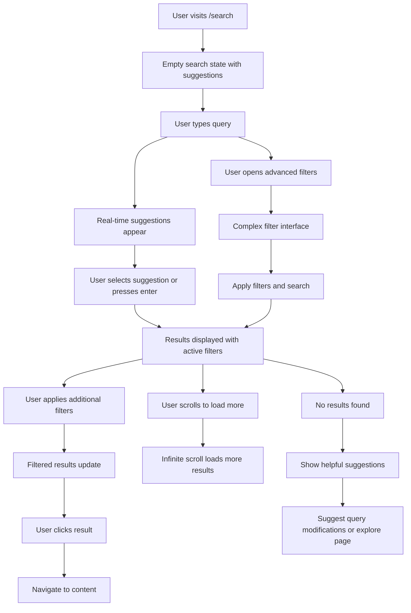
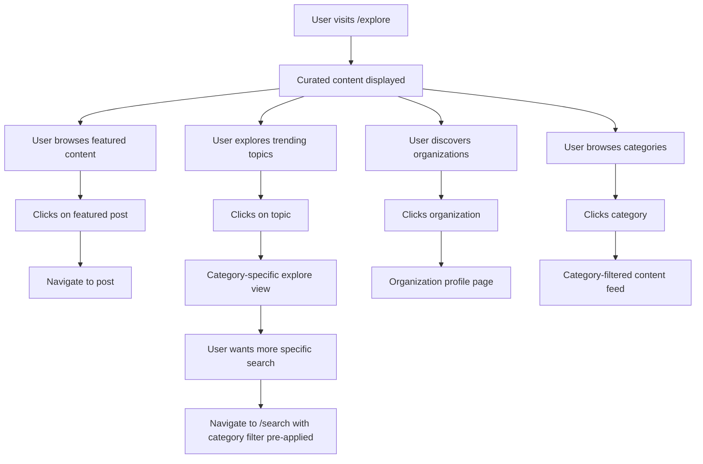

# Search & Discovery UX Design Strategy

## Overview

This document focuses on the user experience design strategy for search and discovery features within our TanStack Start blogging platform. It defines interface layouts, user interaction patterns, and discovery workflows that create an intuitive content exploration experience.

**Related Documentation:**

- **[Search API Implementation](../../docs/api/search.md)** - Complete server function implementations and React Query integration
- **[Database Architecture](../../docs/architecture/database.md)** - PostgreSQL optimization and schema design for search performance
- **[Component Patterns](../../docs/development/component-patterns.md)** - Search filter components and real-time search hooks
- **[Navigation Architecture](./ux_architecture_navigation_design.md)** - Overall UX strategy and navigation patterns

## Core UX Principles

### 1. Progressive Disclosure with Advanced Filtering Priority

- **Basic search** - Immediate universal search input
- **Advanced filtering** - Comprehensive filter system as primary feature (not hidden)
- **Filter persistence** - User filter preferences remembered across sessions
- **Mobile-first filtering** - Touch-friendly filter interfaces with bottom sheets

### 2. Dual Discovery Strategy

- **`/search`** - Intentional discovery with powerful filtering
- **`/explore`** - Curated discovery through editorial and algorithmic content
- **Clear separation** - Distinct purposes prevent user confusion
- **Cross-navigation** - Seamless movement between search and explore

### 3. Context-Aware Search Experience

- **Organization-scoped** - Search within organization context when relevant
- **Permission-aware** - Results filtered by user access permissions
- **Personalized** - Search history and preferences for authenticated users
- **Analytics-driven** - User behavior insights inform UX improvements

## Search Interface Design (/search)

### Desktop Search Layout

```text
┌─────────────────────────────────────────────────────────────────┐
│ [🔍] Search posts, people, and organizations...        [⚙️]     │
├─────────────────────────────────────────────────────────────────┤
│ Quick Filters: [All] [Posts] [People] [Organizations]          │
│ ┌─[Date: Any time ▼]─[Sort: Relevance ▼]─[More filters ▼]─┐   │
├─┴─────────────────────────────────────────────────────────────┴─┤
│                                                                 │
│ 🔥 Popular this week: #react #typescript #design-systems       │
│                                                                 │
│ Search Results (1,234 results in 0.03s)                       │
│                                                                 │
│ ┌─────────────────────────────────────────────────────────────┐ │
│ │ 📝 How to Build Modern Web Applications                     │ │
│ │ by John Doe · TechCorp · 5 min read · Mar 15, 2024        │ │
│ │ Learn the fundamentals of building modern web apps...      │ │
│ │ #react #typescript #web-development                         │ │
│ └─────────────────────────────────────────────────────────────┘ │
│                                                                 │
│ ┌─────────────────────────────────────────────────────────────┐ │
│ │ 👤 Sarah Johnson                                            │ │
│ │ Senior Developer at DevCorp · 150 followers                │ │
│ │ Writes about: React, Node.js, Database Design              │ │
│ │ Latest post: "Database Optimization Tips" · 2 days ago     │ │
│ └─────────────────────────────────────────────────────────────┘ │
│                                                                 │
│                        [Load More Results]                      │
└─────────────────────────────────────────────────────────────────┘
```

### Advanced Filters Panel (Expandable)

```text
┌─────────────────────────────────────────┐
│ Advanced Filters                    [×] │
├─────────────────────────────────────────┤
│ Content Type                           │
│ ☑️ Posts    ☑️ People    ☑️ Organizations │
│                                         │
│ 📅 Date Range                           │
│ ◯ Any time   ◯ Past week   ◯ Past month │
│ ◯ Past year  ● Custom range             │
│ From: [Mar 1, 2024] To: [Mar 31, 2024] │
│                                         │
│ 🏷️ Categories                           │
│ ☑️ Technology  ☑️ Design  ☐ Business     │
│ ☐ Science     ☐ Health   ☐ Education   │
│                                         │
│ 🔖 Tags                                 │
│ [react        ×] [typescript    ×]      │
│ [+ Add tag...]                          │
│                                         │
│ 📖 Reading Time (Posts)                 │
│ ◯ Any  ◯ < 5 min  ◯ 5-10 min  ◯ > 10min │
│                                         │
│ 🏢 Organization                         │
│ [Select organization...]                │
│                                         │
│ ✍️ Author                               │
│ [Search authors...]                     │
│                                         │
│ 💯 Engagement                           │
│ Min likes: [____]  Min views: [____]   │
│                                         │
│ Active Filters: 3                       │
│      [Reset All]    [Apply Filters]     │
└─────────────────────────────────────────┘
```

### Mobile Search Interface

```text
┌─────────────────────────┐
│ [🔍] Search...      [⚙️] │
├─────────────────────────┤
│ [All] [Posts] [People]   │
├─────────────────────────┤
│ 🔥 #react #design       │
├─────────────────────────┤
│ 📝 Modern Web Apps      │
│ John Doe · 5 min read   │
│ TechCorp · Mar 15       │
│ #react #typescript      │
├─────────────────────────┤
│ 👤 Sarah Johnson        │
│ Senior Developer        │
│ DevCorp · 150 followers │
├─────────────────────────┤
│ 🏢 TechStartup Inc.     │
│ 25 members · 87 posts   │
│ Technology              │
├─────────────────────────┤
│    [Load More...]       │
└─────────────────────────┘

// Filters slide up from bottom
┌─────────────────────────┐
│      Filters        [×] │
├─────────────────────────┤
│ Content                 │
│ [Posts] [People] [Orgs] │
│                         │
│ 📅 Date: [Any time ▼]   │
│ 🔀 Sort: [Relevance ▼]  │
│                         │
│ 🏷️ Categories            │
│ ☑️ Tech  ☐ Design       │
│ ☐ Business ☐ Science    │
│                         │
│ Active: 3 filters       │
│   [Clear] [Apply (15)]  │
└─────────────────────────┘
```

## Discovery Interface Design (/explore)

### Desktop Explore Layout

```text
┌─────────────────────────────────────────────────────────────────┐
│                        Explore Content                          │
├─────────────────────────────────────────────────────────────────┤
│                                                                 │
│ 🌟 Featured This Week                                          │
│ ┌─────────┐ ┌─────────┐ ┌─────────┐ ┌─────────┐ ┌─────────┐   │
│ │[Image]  │ │[Image]  │ │[Image]  │ │[Image]  │ │[Image]  │   │
│ │Title 1  │ │Title 2  │ │Title 3  │ │Title 4  │ │Title 5  │   │
│ │Author   │ │Author   │ │Author   │ │Author   │ │Author   │   │
│ │5 min    │ │8 min    │ │3 min    │ │12 min   │ │6 min    │   │
│ └─────────┘ └─────────┘ └─────────┘ └─────────┘ └─────────┘   │
│                                                      [See All] │
│                                                                 │
│ 📈 Trending Topics                                             │
│ ┌──────────────┐ ┌──────────────┐ ┌──────────────┐            │
│ │ 🚀 Technology│ │ 🎨 Design    │ │ 💼 Business  │            │
│ │ 1,234 posts  │ │ 987 posts    │ │ 654 posts    │            │
│ │ +15% growth  │ │ +8% growth   │ │ +12% growth  │            │
│ │ [Explore]    │ │ [Explore]    │ │ [Explore]    │            │
│ └──────────────┘ └──────────────┘ └──────────────┘            │
│                                                                 │
│ 🏢 Active Organizations                                        │
│ ┌─────────────────────────────────────────────────────────────┐ │
│ │ TechCorp        DevStudio      StartupHub    InnovationLab  │ │
│ │ 45 new posts    32 new posts   28 new posts  21 new posts  │ │
│ │ [Follow]        [Follow]       [Follow]      [Follow]      │ │
│ └─────────────────────────────────────────────────────────────┘ │
│                                                      [See All] │
│                                                                 │
│ 📚 Browse by Category                                          │
│ ┌─Technology──┐ ┌─Design─────┐ ┌─Business───┐ ┌─Science────┐  │
│ │ React       │ │ UI/UX      │ │ Startup    │ │ AI/ML      │  │
│ │ TypeScript  │ │ Figma      │ │ Finance    │ │ Data       │  │
│ │ Node.js     │ │ Prototyping│ │ Marketing  │ │ Research   │  │
│ │ DevOps      │ │ Branding   │ │ Strategy   │ │ Innovation │  │
│ └─────────────┘ └─────────────┘ └─────────────┘ └─────────────┘ │
│                                                                 │
│ 🔥 Rising Writers                                              │
│ [Profile cards of emerging authors with growth metrics]         │
│                                                                 │
│ 📊 Platform Stats                                              │
│ Posts this week: 2,847 | New writers: 156 | Active orgs: 89   │
└─────────────────────────────────────────────────────────────────┘
```

### Mobile Explore Layout

```text
┌─────────────────────────┐
│       Explore           │
├─────────────────────────┤
│ 🌟 Featured             │
│ ┌─────────────────────┐ │
│ │ [Featured Post Img] │ │
│ │ How to Scale React  │ │
│ │ Sarah J · 8 min     │ │
│ └─────────────────────┘ │
│ ◀ [Swipe for more...] ▶ │
│                         │
│ 📈 Trending             │
│ ┌─────┐ ┌─────┐ ┌─────┐ │
│ │🚀Tech│ │🎨Des│ │💼Biz │ │
│ │1234 │ │ 987 │ │654  │ │
│ │+15% │ │ +8% │ │+12% │ │
│ └─────┘ └─────┘ └─────┘ │
│                         │
│ 🏢 Organizations        │
│ TechCorp (45 posts)     │
│ DevStudio (32 posts)    │
│ [See more...]           │
│                         │
│ 📚 Categories           │
│ [2×2 grid of categories]│
│                         │
│ 🔥 Rising Writers       │
│ [Vertical list of       │
│  rising author cards]   │
└─────────────────────────┘
```

## User Flow Design Patterns

### Search Journey Map



### Discovery Journey Map



## Interactive States & Micro-interactions

### Search Input States

```text
// Empty State
┌─────────────────────────────────────────┐
│ [🔍] Search posts, people, organizations│
│                                         │
│ 💡 Try searching for:                   │
│ • "React hooks tutorial"                │
│ • "Sarah Johnson" (author)              │
│ • "TechCorp" (organization)             │
│                                         │
│ 🔥 Popular searches:                    │
│ #react #typescript #design-patterns     │
└─────────────────────────────────────────┘

// Typing State (Real-time suggestions)
┌─────────────────────────────────────────┐
│ [🔍] react h|                           │
│ ├─ react hooks                          │
│ ├─ react hooks tutorial                 │
│ ├─ react hooks best practices           │
│ └─ react hooks testing                  │
│                                         │
│ 📝 Recent posts about "react h..."      │
│ • Advanced React Hooks by Jane Doe      │
│ • React Hooks Testing Guide by Tech...  │
└─────────────────────────────────────────┘

// Loading State
┌─────────────────────────────────────────┐
│ [🔍] react hooks                        │
│                                         │
│ [🌀] Searching for "react hooks"...     │
│                                         │
│ Found preliminary results...            │
└─────────────────────────────────────────┘
```

### Filter Interaction States

```text
// Filter Badge Active State
[📅 Past Week ×] [🏷️ Technology ×] [👤 Jane Doe ×]

// Filter Count Indicator
Advanced Filters (3 active)

// Filter Application Feedback
✅ 3 filters applied • 847 results found

// Filter Conflict Resolution
⚠️ No results found with current filters
💡 Try removing "Past Day" or "Minimum 100 likes"
```

## Empty States & Error Handling

### Search Empty States

```text
// No Search Query
┌─────────────────────────────────────────┐
│              🔍 Discover Content         │
│                                         │
│ Find posts, people, and organizations   │
│ across our platform                     │
│                                         │
│ 💡 Popular searches:                    │
│ #react #typescript #design #startup     │
│                                         │
│ 🌟 Or explore curated content:          │
│         [Visit Explore Page]            │
└─────────────────────────────────────────┘

// Zero Results
┌─────────────────────────────────────────┐
│           🔍 No results found            │
│                                         │
│ We couldn't find anything matching      │
│ "quantum computing tutorials"           │
│                                         │
│ 💡 Try:                                 │
│ • Check your spelling                   │
│ • Use different keywords                │
│ • Remove some filters                   │
│                                         │
│ 🔄 Search instead for:                  │
│ • "quantum computing"                   │
│ • "physics tutorials"                   │
│ • "computer science"                    │
│                                         │
│        [Explore Related Content]        │
└─────────────────────────────────────────┘

// Search Error State
┌─────────────────────────────────────────┐
│           ⚠️ Search Unavailable          │
│                                         │
│ We're having trouble with search        │
│ right now. Please try again.            │
│                                         │
│         [Try Again] [Explore]           │
│                                         │
│ Or browse content by category:          │
│ [Technology] [Design] [Business]        │
└─────────────────────────────────────────┘
```

## Accessibility & Inclusive Design

### Keyboard Navigation Patterns

```text
Search Interface Keyboard Support:
• Tab: Move between search input, filters, and results
• Enter: Execute search or select suggestion
• Escape: Clear search or close filter panels
• Arrow Keys: Navigate search suggestions and results
• Cmd/Ctrl+K: Focus search input from anywhere
• Cmd/Ctrl+F: Open advanced filters
• Cmd/Ctrl+↑/↓: Navigate between result types
```

### Screen Reader Announcements

```text
// Search Results Loading
"Searching for react hooks... Found 847 results"

// Filter Applied
"Technology filter applied. Results updated to show 234 posts"

// Navigation Between Sections
"Now viewing posts section. 145 results"
"Now viewing people section. 23 results"
"Now viewing organizations section. 12 results"

// Zero Results
"No results found for 'quantum computing tutorials'. Try different keywords or browse suggested topics."
```

### Visual Accessibility Features

```text
// High Contrast Support
- Filter badges with strong border contrast
- Search focus indicators clearly visible
- Result type indicators with icon + text

// Motion Preferences
- Respect prefers-reduced-motion for filter animations
- Optional auto-scroll to results can be disabled
- Loading indicators use fade instead of spin for sensitive users

// Text Scaling
- Interface remains functional at 200% zoom
- Filter panels adapt to larger text sizes
- Mobile touch targets minimum 44px
```

## Performance UX Indicators

### Search Performance Feedback

```text
// Fast Search (< 200ms)
Search Results (1,234 results)

// Moderate Search (200-500ms)
Search Results (1,234 results in 0.34s)

// Slower Search (> 500ms)
🐌 Search Results (1,234 results in 1.2s)
💡 Try fewer filters for faster results

// Progressive Loading
🔍 Searching... (0.1s)
📝 Found posts... (0.3s)
👤 Finding people... (0.5s)
🏢 Locating organizations... (0.7s)
✅ Complete (847 total results)
```

### Real-time Search Indicators

```text
// Typing Indicator
[🔍] react h| (typing...)

// Debounced Search
[🔍] react hooks (⏱️ searching in 0.2s...)

// Network Issues
[🔍] react hooks (🔄 retrying search...)

// Cached Results
[🔍] react hooks (⚡ instant results from cache)
```

## Mobile-Specific UX Considerations

### Touch Gestures & Interactions

```text
// Swipe Gestures
- Swipe left/right on result cards for quick actions
- Pull down to refresh search results
- Swipe up from bottom for filter panel

// Touch-Friendly Targets
- Filter chips minimum 44px height
- Search input 48px minimum height
- Result cards with generous padding
- Clear touch targets for all interactive elements

// Progressive Disclosure
- Show 3-4 filters initially, "Show more" for additional
- Collapsible filter groups to manage screen space
- Smart keyboard that adapts to search context
```

### Mobile Performance Optimizations

```text
// Efficient Loading
- Load 10 results initially, infinite scroll for more
- Lazy load images in result cards
- Debounce search input to reduce network requests
- Cache recent searches for offline access

// Battery & Data Consciousness
- Pause real-time search when app backgrounded
- Compress images in result previews
- Batch analytics events to reduce requests
- Use system dark mode to save battery
```

## Success Metrics & UX Goals

### Primary UX Metrics

```text
Search Success Metrics:
• Search-to-click rate > 60%
• Zero-result query rate < 15%
• Average search session length > 2 minutes
• Filter usage rate > 40% of searches
• Mobile search completion rate > 90%

Discovery Success Metrics:
• Explore page bounce rate < 30%
• Category exploration rate > 25%
• Featured content click-through rate > 15%
• Organization discovery rate > 10%
• Time on explore page > 1.5 minutes
```

### User Satisfaction Indicators

```text
Qualitative UX Goals:
• Users find search results relevant and helpful
• Filter system feels powerful but not overwhelming
• Mobile experience rivals desktop functionality
• Discovery through explore feels serendipitous
• Search performance feels instant and responsive
```

This UX design strategy creates a search and discovery experience that balances powerful functionality with intuitive usability, ensuring users can efficiently find content while discovering new interests through curated exploration.
