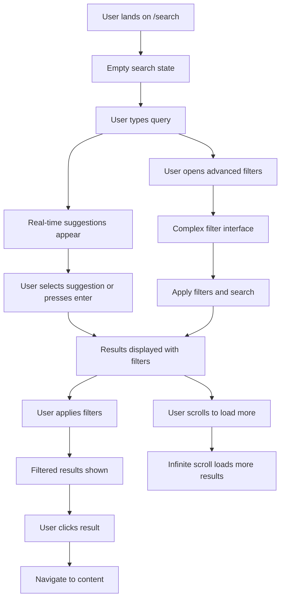
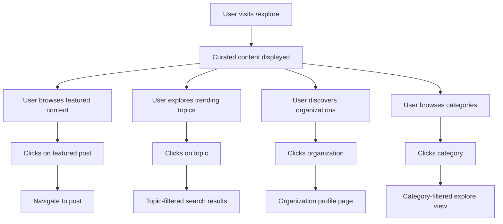

# Search & Discovery UX Strategy

## Executive Summary

This document outlines the comprehensive UX design for a Search & Discovery system for our TanStack Start-based blogging platform. The system focuses on PostgreSQL optimization, advanced filtering capabilities, and exceptional user experience while maintaining performance at scale.

**Related Strategic Documents:**

- **[Content Creation System Design](./content_creation_writing_interface_design.md)** - Content authoring and publishing workflows that feed into search
- **[Navigation Architecture](./ux_architecture_navigation_design.md)** - Organization-aware navigation and discovery patterns
- **[Implementation Roadmap](./implementation_roadmap_content_creation.md)** - Development planning for content and search features

**Technical Implementation:**

- **[Project Overview](../../docs/overview/introduction.md)** - Technical architecture and current project status
- **[Database Design](../../docs/architecture/database.md)** - PostgreSQL schema and full-text search optimization
- **[Development Guide](../../docs/development/index.md)** - Performance patterns and query optimization
- **[Search API Reference](../../docs/api/search.md)** - Implementation details for search endpoints

### Key Design Principles

- **PostgreSQL-First**: Optimized full-text search without external dependencies
- **Advanced Filtering Priority**: Robust filtering system as primary feature
- **Mobile-Optimized UX**: Progressive disclosure and touch-friendly interfaces
- **Performance-Conscious**: Strategic indexing and query optimization
- **Analytics-Ready**: Sentry/PostHog integration for user behavior insights

### Core Features

1. Universal search with intelligent ranking
2. Advanced filtering system with multiple content types
3. Topic-based content discovery
4. Organization-centric exploration
5. Real-time search with proper optimization
6. Search history and personalization

---

## User Experience Design

### Search Interface (/search)

#### Desktop Layout

```text
┌─────────────────────────────────────────────────────────────────┐
│ [🔍] Search posts, people, and organizations...        [⚙️]     │
├─────────────────────────────────────────────────────────────────┤
│ Quick Filters: [All] [Posts] [People] [Organizations]          │
│ ┌─[Date: Any time ▼]─[Sort: Relevance ▼]─[More filters ▼]─┐   │
├─┴─────────────────────────────────────────────────────────────┴─┤
│                                                                 │
│ Search Results (1,234 results in 0.03s)                       │
│                                                                 │
│ ┌─────────────────────────────────────────────────────────────┐ │
│ │ 📝 How to Build Modern Web Applications                     │ │
│ │ by John Doe · TechCorp · 5 min read · Mar 15, 2024        │ │
│ │ Learn the fundamentals of building modern web apps...      │ │
│ │ #react #typescript #web-development                         │ │
│ └─────────────────────────────────────────────────────────────┘ │
│                                                                 │
│ ┌─────────────────────────────────────────────────────────────┐ │
│ │ 👤 Sarah Johnson                                            │ │
│ │ Senior Developer at DevCorp · 150 followers                │ │
│ │ Writes about: React, Node.js, Database Design              │ │
│ │ Latest post: "Database Optimization Tips" · 2 days ago     │ │
│ └─────────────────────────────────────────────────────────────┘ │
│                                                                 │
│ ┌─────────────────────────────────────────────────────────────┐ │
│ │ 🏢 TechStartup Inc.                                         │ │
│ │ 25 members · 87 posts · Technology                         │ │
│ │ Building the future of web development...                   │ │
│ │ Recent: "Our Journey to TypeScript" · 1 week ago           │ │
│ └─────────────────────────────────────────────────────────────┘ │
│                                                                 │
│                        [Load More Results]                      │
└─────────────────────────────────────────────────────────────────┘
```

#### Advanced Filters Panel

```text
┌─────────────────────────────────────────┐
│ Advanced Filters                    [×] │
├─────────────────────────────────────────┤
│ Content Type                           │
│ ☑️ Posts    ☑️ People    ☑️ Organizations │
│                                         │
│ Date Range                              │
│ ◯ Any time   ◯ Past week   ◯ Past month │
│ ◯ Past year  ● Custom range             │
│ From: [Mar 1, 2024] To: [Mar 31, 2024] │
│                                         │
│ Categories                              │
│ ☑️ Technology  ☑️ Design  ☐ Business     │
│ ☐ Science     ☐ Health   ☐ Education   │
│                                         │
│ Tags                                    │
│ [react        ×] [typescript    ×]      │
│ [+ Add tag...]                          │
│                                         │
│ Reading Time (Posts)                    │
│ ◯ Any  ◯ < 5 min  ◯ 5-10 min  ◯ > 10min │
│                                         │
│ Organization                            │
│ [Select organization...]                │
│                                         │
│ Author                                  │
│ [Search authors...]                     │
│                                         │
│ Engagement                              │
│ Min likes: [____]  Min views: [____]   │
│                                         │
│      [Reset All]    [Apply Filters]     │
└─────────────────────────────────────────┘
```

#### Mobile Search Interface

```text
┌─────────────────────────┐
│ [🔍] Search...      [⚙️] │
├─────────────────────────┤
│ [All] [Posts] [People]   │
├─────────────────────────┤
│ 📝 Modern Web Apps      │
│ John Doe · 5 min read   │
│ TechCorp · Mar 15       │
│ #react #typescript      │
├─────────────────────────┤
│ 👤 Sarah Johnson        │
│ Senior Developer        │
│ DevCorp · 150 followers │
├─────────────────────────┤
│ 🏢 TechStartup Inc.     │
│ 25 members · 87 posts   │
│ Technology              │
├─────────────────────────┤
│    [Load More...]       │
└─────────────────────────┘

// Filters slide up from bottom
┌─────────────────────────┐
│      Filters        [×] │
├─────────────────────────┤
│ Content                 │
│ [Posts] [People] [Orgs] │
│                         │
│ Date: [Any time ▼]      │
│ Sort: [Relevance ▼]     │
│                         │
│ Categories              │
│ ☑️ Tech  ☐ Design       │
│ ☐ Business ☐ Science    │
│                         │
│   [Clear] [Apply (15)]  │
└─────────────────────────┘
```

### Discovery Interface (/explore)

#### Desktop Explore Layout

```text
┌─────────────────────────────────────────────────────────────────┐
│                        Explore Content                          │
├─────────────────────────────────────────────────────────────────┤
│                                                                 │
│ 🌟 Featured This Week                                          │
│ ┌─────────┐ ┌─────────┐ ┌─────────┐ ┌─────────┐ ┌─────────┐   │
│ │[Image]  │ │[Image]  │ │[Image]  │ │[Image]  │ │[Image]  │   │
│ │Title 1  │ │Title 2  │ │Title 3  │ │Title 4  │ │Title 5  │   │
│ │Author   │ │Author   │ │Author   │ │Author   │ │Author   │   │
│ └─────────┘ └─────────┘ └─────────┘ └─────────┘ └─────────┘   │
│                                                      [See All] │
│                                                                 │
│ 📈 Trending Topics                                             │
│ ┌──────────────┐ ┌──────────────┐ ┌──────────────┐            │
│ │ 🚀 Technology│ │ 🎨 Design    │ │ 💼 Business  │            │
│ │ 1,234 posts  │ │ 987 posts    │ │ 654 posts    │            │
│ │ +15% growth  │ │ +8% growth   │ │ +12% growth  │            │
│ └──────────────┘ └──────────────┘ └──────────────┘            │
│                                                                 │
│ 🏢 Active Organizations                                        │
│ ┌─────────────────────────────────────────────────────────────┐ │
│ │ TechCorp        DevStudio      StartupHub    InnovationLab  │ │
│ │ 45 new posts    32 new posts   28 new posts  21 new posts  │ │
│ │ [Follow]        [Follow]       [Follow]      [Follow]      │ │
│ └─────────────────────────────────────────────────────────────┘ │
│                                                      [See All] │
│                                                                 │
│ 📚 Browse by Category                                          │
│ ┌─Technology──┐ ┌─Design─────┐ ┌─Business───┐ ┌─Science────┐  │
│ │ React       │ │ UI/UX      │ │ Startup    │ │ AI/ML      │  │
│ │ TypeScript  │ │ Figma      │ │ Finance    │ │ Data       │  │
│ │ Node.js     │ │ Prototyping│ │ Marketing  │ │ Research   │  │
│ │ DevOps      │ │ Branding   │ │ Strategy   │ │ Innovation │  │
│ └─────────────┘ └─────────────┘ └─────────────┘ └─────────────┘ │
│                                                                 │
│ 🔥 Rising Writers                                              │
│ [Profile cards of emerging authors with growth metrics]         │
│                                                                 │
│ 📊 Platform Stats                                              │
│ [Visual stats: posts this week, new users, active orgs, etc.]  │
└─────────────────────────────────────────────────────────────────┘
```

#### Mobile Explore Layout

```text
┌─────────────────────────┐
│       Explore           │
├─────────────────────────┤
│ 🌟 Featured             │
│ ┌─────────────────────┐ │
│ │ [Featured Post]     │ │
│ │ Title               │ │
│ │ Author · 5 min      │ │
│ └─────────────────────┘ │
│ [Horizontal scroll...]  │
│                         │
│ 📈 Trending Topics      │
│ ┌─────┐ ┌─────┐ ┌─────┐ │
│ │ Tech│ │Design│ │Biz  │ │
│ │1234 │ │ 987 │ │654  │ │
│ └─────┘ └─────┘ └─────┘ │
│                         │
│ 🏢 Organizations        │
│ TechCorp (45 posts)     │
│ DevStudio (32 posts)    │
│ [See all...]            │
│                         │
│ 📚 Categories           │
│ [Grid of category cards]│
│                         │
│ 🔥 Rising Writers       │
│ [Vertical list of       │
│  author cards]          │
└─────────────────────────┘
```

### User Flows

#### Search Flow



#### Discovery Flow



---

## Advanced Filtering System

### Filter Architecture

The advanced filtering system is designed with flexibility and performance as core principles. It supports multiple content types with shared filter patterns and type-specific filters.

#### Filter Types and Components

```typescript
// src/modules/search/types/filters.ts
export type FilterValue =
  | string
  | number
  | boolean
  | string[]
  | number[]
  | DateRange;

export interface DateRange {
  from?: string;
  to?: string;
}

export interface NumericRange {
  min?: number;
  max?: number;
}

export interface BaseFilter {
  id: string;
  label: string;
  type:
    | 'select'
    | 'multi-select'
    | 'date-range'
    | 'numeric-range'
    | 'boolean'
    | 'search';
  category: 'content' | 'metadata' | 'engagement' | 'temporal';
  value?: FilterValue;
  options?: FilterOption[];
  placeholder?: string;
  validation?: FilterValidation;
}

export interface FilterOption {
  value: string | number;
  label: string;
  count?: number; // For faceted search
  color?: string; // For visual filters like tags/categories
  icon?: string; // Lucide icon name
}

export interface FilterValidation {
  required?: boolean;
  min?: number;
  max?: number;
  pattern?: RegExp;
}

export interface FilterGroup {
  id: string;
  label: string;
  icon?: string;
  collapsible: boolean;
  defaultExpanded: boolean;
  filters: BaseFilter[];
}
```

#### Dynamic Filter Configuration

```typescript
// src/modules/search/config/filter-config.ts
import type { FilterGroup } from '@/modules/search/types/filters';

export const searchFilterConfig: Record<string, FilterGroup[]> = {
  posts: [
    {
      id: 'content-type',
      label: 'Content',
      icon: 'FileText',
      collapsible: false,
      defaultExpanded: true,
      filters: [
        {
          id: 'content-type',
          label: 'Content Type',
          type: 'multi-select',
          category: 'content',
          options: [
            { value: 'posts', label: 'Posts', icon: 'FileText' },
            { value: 'users', label: 'People', icon: 'Users' },
            {
              value: 'organizations',
              label: 'Organizations',
              icon: 'Building',
            },
          ],
        },
      ],
    },
    {
      id: 'categorization',
      label: 'Topics & Tags',
      icon: 'Tag',
      collapsible: true,
      defaultExpanded: false,
      filters: [
        {
          id: 'categories',
          label: 'Categories',
          type: 'multi-select',
          category: 'metadata',
          placeholder: 'Select categories...',
          // Options populated dynamically from API
        },
        {
          id: 'tags',
          label: 'Tags',
          type: 'multi-select',
          category: 'metadata',
          placeholder: 'Search tags...',
          // Options populated dynamically with search
        },
      ],
    },
    {
      id: 'metadata',
      label: 'Post Details',
      icon: 'Info',
      collapsible: true,
      defaultExpanded: false,
      filters: [
        {
          id: 'reading-time',
          label: 'Reading Time',
          type: 'select',
          category: 'metadata',
          options: [
            { value: 'any', label: 'Any length' },
            { value: '0-5', label: 'Quick read (< 5 min)' },
            { value: '5-10', label: 'Medium read (5-10 min)' },
            { value: '10-999', label: 'Long read (> 10 min)' },
          ],
        },
        {
          id: 'author',
          label: 'Author',
          type: 'search',
          category: 'metadata',
          placeholder: 'Search authors...',
        },
        {
          id: 'organization',
          label: 'Organization',
          type: 'search',
          category: 'metadata',
          placeholder: 'Search organizations...',
        },
      ],
    },
    {
      id: 'temporal',
      label: 'Date & Time',
      icon: 'Calendar',
      collapsible: true,
      defaultExpanded: false,
      filters: [
        {
          id: 'date-range',
          label: 'Published Date',
          type: 'date-range',
          category: 'temporal',
        },
        {
          id: 'date-preset',
          label: 'Quick Date Filter',
          type: 'select',
          category: 'temporal',
          options: [
            { value: 'any', label: 'Any time' },
            { value: 'today', label: 'Today' },
            { value: 'week', label: 'Past week' },
            { value: 'month', label: 'Past month' },
            { value: 'year', label: 'Past year' },
          ],
        },
      ],
    },
    {
      id: 'engagement',
      label: 'Engagement',
      icon: 'Heart',
      collapsible: true,
      defaultExpanded: false,
      filters: [
        {
          id: 'min-likes',
          label: 'Minimum Likes',
          type: 'numeric-range',
          category: 'engagement',
          validation: { min: 0, max: 10000 },
        },
        {
          id: 'min-views',
          label: 'Minimum Views',
          type: 'numeric-range',
          category: 'engagement',
          validation: { min: 0, max: 100000 },
        },
        {
          id: 'engagement-level',
          label: 'Engagement Level',
          type: 'select',
          category: 'engagement',
          options: [
            { value: 'any', label: 'Any engagement' },
            { value: 'high', label: 'Highly engaged (>100 likes)' },
            { value: 'medium', label: 'Well engaged (>25 likes)' },
            { value: 'new', label: 'Emerging content (<5 likes)' },
          ],
        },
      ],
    },
  ],
  users: [
    {
      id: 'user-metadata',
      label: 'Profile',
      icon: 'User',
      collapsible: false,
      defaultExpanded: true,
      filters: [
        {
          id: 'user-type',
          label: 'User Type',
          type: 'select',
          category: 'metadata',
          options: [
            { value: 'all', label: 'All users' },
            { value: 'active-writers', label: 'Active writers' },
            { value: 'organizations-members', label: 'Organization members' },
            { value: 'verified', label: 'Verified users' },
          ],
        },
        {
          id: 'follower-count',
          label: 'Followers',
          type: 'select',
          category: 'engagement',
          options: [
            { value: 'any', label: 'Any following' },
            { value: '0-10', label: 'New (< 10 followers)' },
            { value: '10-100', label: 'Growing (10-100 followers)' },
            { value: '100-1000', label: 'Popular (100-1000 followers)' },
            { value: '1000+', label: 'Influential (> 1000 followers)' },
          ],
        },
      ],
    },
    {
      id: 'activity',
      label: 'Activity',
      icon: 'Activity',
      collapsible: true,
      defaultExpanded: false,
      filters: [
        {
          id: 'post-count',
          label: 'Posts Published',
          type: 'numeric-range',
          category: 'engagement',
          validation: { min: 0, max: 1000 },
        },
        {
          id: 'last-active',
          label: 'Last Active',
          type: 'select',
          category: 'temporal',
          options: [
            { value: 'any', label: 'Any time' },
            { value: 'today', label: 'Today' },
            { value: 'week', label: 'This week' },
            { value: 'month', label: 'This month' },
            { value: 'inactive', label: 'Inactive (> 3 months)' },
          ],
        },
      ],
    },
  ],
  organizations: [
    {
      id: 'org-metadata',
      label: 'Organization',
      icon: 'Building',
      collapsible: false,
      defaultExpanded: true,
      filters: [
        {
          id: 'org-size',
          label: 'Size',
          type: 'select',
          category: 'metadata',
          options: [
            { value: 'any', label: 'Any size' },
            { value: '1-5', label: 'Small (1-5 members)' },
            { value: '5-25', label: 'Medium (5-25 members)' },
            { value: '25-100', label: 'Large (25-100 members)' },
            { value: '100+', label: 'Enterprise (> 100 members)' },
          ],
        },
        {
          id: 'org-activity',
          label: 'Activity Level',
          type: 'select',
          category: 'engagement',
          options: [
            { value: 'any', label: 'Any activity' },
            { value: 'very-active', label: 'Very active (> 10 posts/month)' },
            { value: 'active', label: 'Active (5-10 posts/month)' },
            { value: 'moderate', label: 'Moderate (1-5 posts/month)' },
            { value: 'quiet', label: 'Quiet (< 1 post/month)' },
          ],
        },
      ],
    },
  ],
};
```

#### Filter State Management

```typescript
// src/modules/search/hooks/use-search-filters.ts
import { useState, useCallback, useMemo } from 'react';
import type { BaseFilter, FilterValue } from '@/modules/search/types/filters';
import { searchFilterConfig } from '@/modules/search/config/filter-config';

export interface FilterState {
  [filterId: string]: FilterValue;
}

export function useSearchFilters(contentType: string = 'posts') {
  const [filters, setFilters] = useState<FilterState>({});
  const [activeFilterCount, setActiveFilterCount] = useState(0);

  const filterConfig = useMemo(() => {
    return searchFilterConfig[contentType] || searchFilterConfig.posts;
  }, [contentType]);

  const updateFilter = useCallback((filterId: string, value: FilterValue) => {
    setFilters((prev) => {
      const newFilters = { ...prev };

      if (
        value === undefined ||
        value === '' ||
        (Array.isArray(value) && value.length === 0)
      ) {
        delete newFilters[filterId];
      } else {
        newFilters[filterId] = value;
      }

      // Update active filter count
      const count = Object.keys(newFilters).filter((key) => {
        const filterValue = newFilters[key];
        return (
          filterValue !== undefined &&
          filterValue !== '' &&
          (!Array.isArray(filterValue) || filterValue.length > 0)
        );
      }).length;

      setActiveFilterCount(count);

      return newFilters;
    });
  }, []);

  const clearFilter = useCallback(
    (filterId: string) => {
      updateFilter(filterId, undefined);
    },
    [updateFilter],
  );

  const clearAllFilters = useCallback(() => {
    setFilters({});
    setActiveFilterCount(0);
  }, []);

  const getFilterValue = useCallback(
    (filterId: string) => {
      return filters[filterId];
    },
    [filters],
  );

  const hasActiveFilters = useMemo(() => {
    return activeFilterCount > 0;
  }, [activeFilterCount]);

  // Convert filter state to search API format
  const toSearchFilters = useCallback(() => {
    const searchFilters: Record<string, unknown> = {};

    Object.entries(filters).forEach(([filterId, value]) => {
      switch (filterId) {
        case 'content-type':
          searchFilters.contentType = Array.isArray(value) ? value : [value];
          break;
        case 'categories':
          searchFilters.categories = Array.isArray(value) ? value : [value];
          break;
        case 'tags':
          searchFilters.tags = Array.isArray(value) ? value : [value];
          break;
        case 'date-range':
          if (typeof value === 'object' && value !== null && 'from' in value) {
            searchFilters.dateRange = value;
          }
          break;
        case 'reading-time':
          if (typeof value === 'string' && value !== 'any') {
            const [min, max] = value.split('-').map(Number);
            searchFilters.readingTime = {
              min,
              max: max === 999 ? undefined : max,
            };
          }
          break;
        case 'min-likes':
          if (typeof value === 'number' && value > 0) {
            searchFilters.minLikes = value;
          }
          break;
        case 'min-views':
          if (typeof value === 'number' && value > 0) {
            searchFilters.minViews = value;
          }
          break;
        // Add more filter mappings as needed
      }
    });

    return searchFilters;
  }, [filters]);

  return {
    filters,
    filterConfig,
    activeFilterCount,
    hasActiveFilters,
    updateFilter,
    clearFilter,
    clearAllFilters,
    getFilterValue,
    toSearchFilters,
  };
}
```

#### Filter Components

```typescript
// src/modules/search/components/filters/filter-panel.tsx
import { useState } from 'react';
import { ChevronDown, ChevronUp, X, RotateCcw } from 'lucide-react';
import { Button } from '@/components/ui/button';
import { Card, CardContent, CardHeader, CardTitle } from '@/components/ui/card';
import { Badge } from '@/components/ui/badge';
import { Collapsible, CollapsibleContent, CollapsibleTrigger } from '@/components/ui/collapsible';
import { FilterGroup } from '@/modules/search/components/filters/filter-group';
import { useSearchFilters } from '@/modules/search/hooks/use-search-filters';

interface FilterPanelProps {
  contentType: string;
  onFiltersChange: (filters: SearchFilters) => void;
  className?: string;
}

export function FilterPanel({ contentType, onFiltersChange, className }: FilterPanelProps) {
  const {
    filterConfig,
    activeFilterCount,
    hasActiveFilters,
    updateFilter,
    clearAllFilters,
    getFilterValue,
    toSearchFilters,
  } = useSearchFilters(contentType);

  const [expandedGroups, setExpandedGroups] = useState<Set<string>>(
    new Set(
      filterConfig
        .filter(group => group.defaultExpanded)
        .map(group => group.id)
    )
  );

  const handleFilterChange = (filterId: string, value: FilterValue) => {
    updateFilter(filterId, value);
    // Debounce the API call
    setTimeout(() => {
      onFiltersChange(toSearchFilters());
    }, 300);
  };

  const toggleGroup = (groupId: string) => {
    setExpandedGroups(prev => {
      const next = new Set(prev);
      if (next.has(groupId)) {
        next.delete(groupId);
      } else {
        next.add(groupId);
      }
      return next;
    });
  };

  const handleClearAll = () => {
    clearAllFilters();
    onFiltersChange({});
  };

  return (
    <Card className={className}>
      <CardHeader className="pb-3">
        <div className="flex items-center justify-between">
          <div className="flex items-center gap-2">
            <CardTitle className="text-lg">Filters</CardTitle>
            {hasActiveFilters && (
              <Badge variant="secondary" className="text-xs">
                {activeFilterCount}
              </Badge>
            )}
          </div>
          {hasActiveFilters && (
            <Button
              variant="ghost"
              size="sm"
              onClick={handleClearAll}
              className="text-muted-foreground hover:text-foreground"
            >
              <RotateCcw className="h-4 w-4 mr-1" />
              Clear
            </Button>
          )}
        </div>
      </CardHeader>
      <CardContent className="space-y-4">
        {filterConfig.map(group => (
          <div key={group.id}>
            {group.collapsible ? (
              <Collapsible
                open={expandedGroups.has(group.id)}
                onOpenChange={() => toggleGroup(group.id)}
              >
                <CollapsibleTrigger asChild>
                  <Button
                    variant="ghost"
                    size="sm"
                    className="w-full justify-between p-2 h-auto"
                  >
                    <div className="flex items-center gap-2">
                      {group.icon && (
                        <span className="text-muted-foreground">
                          {/* Icon component would go here */}
                        </span>
                      )}
                      <span className="font-medium">{group.label}</span>
                    </div>
                    {expandedGroups.has(group.id) ? (
                      <ChevronUp className="h-4 w-4" />
                    ) : (
                      <ChevronDown className="h-4 w-4" />
                    )}
                  </Button>
                </CollapsibleTrigger>
                <CollapsibleContent>
                  <FilterGroup
                    group={group}
                    values={getFilterValue}
                    onChange={handleFilterChange}
                  />
                </CollapsibleContent>
              </Collapsible>
            ) : (
              <FilterGroup
                group={group}
                values={getFilterValue}
                onChange={handleFilterChange}
              />
            )}
          </div>
        ))}
      </CardContent>
    </Card>
  );
}
```

---

## Implementation Guidelines

### Mobile-First Design Considerations

- **Progressive Disclosure**: Advanced filters appear in bottom sheet modal on mobile
- **Touch-Friendly Interactions**: Minimum 44px touch targets for all interactive elements
- **Gesture Support**: Swipe gestures for horizontal carousels and navigation
- **Performance**: Virtualized lists for long result sets

### Accessibility Features

- **Screen Reader Support**: Proper ARIA labels and descriptions for all filter controls
- **Keyboard Navigation**: Full keyboard accessibility with logical tab order
- **Color Contrast**: WCAG AA compliant color ratios throughout interface
- **Focus Management**: Clear visual focus indicators and logical focus flow

### Performance Optimizations

- **Debounced Input**: Search queries debounced to 300ms to prevent excessive API calls
- **Virtual Scrolling**: Implemented for result lists exceeding 50 items
- **Filter Caching**: Filter options cached and refreshed strategically
- **Progressive Enhancement**: Core search functionality works without JavaScript

This UX strategy provides the foundation for implementing a sophisticated yet intuitive search and discovery system that serves users efficiently while maintaining excellent performance characteristics.
